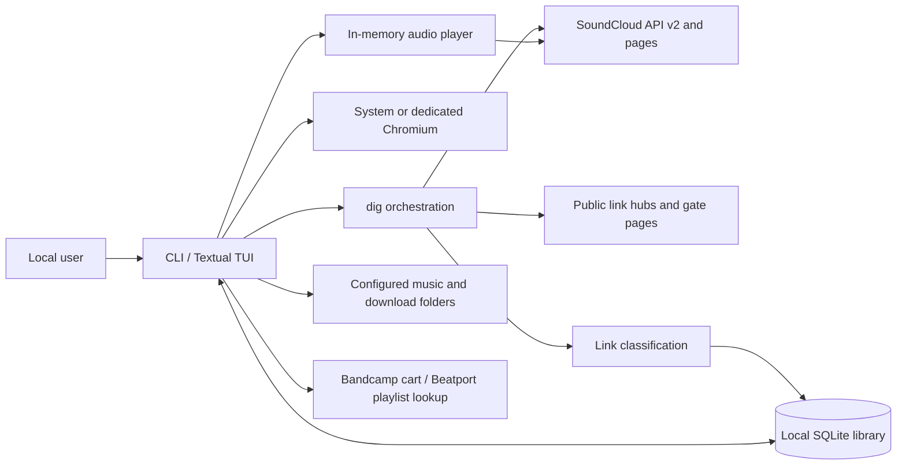

# PROJECT SPECIFICATION — dj-soundcloud-digger

- Status: current implemented system
- Document version: 1.0
- Product version verified: 0.15.0
- Owner: Filip Białogrecki
- Updated: 2026-08-28
- Document lines: <!-- SPEC TOTAL LINES -->981<!-- END SPEC TOTAL LINES -->
- Section map covers through line: <!-- SPEC MAP LIMIT -->981<!-- END SPEC MAP LIMIT -->
- Verified against: `pyproject.toml`, `dj_digger/`, `tests/`, `.github/workflows/`, `README.md`, and `CHANGELOG.md`

## Purpose of this file

This file is the durable source of truth for the product and system that are
implemented in the current repository. It records shipped behavior, component
boundaries, interfaces, persistence, security, privacy, integrations, and
verification. It does not contain a roadmap, target design, implementation plan,
or proposed feature. Agents use it to load only the context required by a task.

When this file disagrees with executable code, configuration, or tests, those
artifacts are evidence of the current state and this file must be corrected in
the same change. A behavior that cannot be confirmed in the repository is not an
implemented behavior.

## How to read this file

Never read this document end to end unless the task explicitly requires an
exhaustive audit. Instead:

1. Print only the metadata and generated map:

   ```bash
   python3 scripts/spec_section_map.py --print-map
   ```

2. Select only the sections relevant to the task.
3. Read only the mapped line ranges.
4. For a known endpoint, field, class, environment variable, function, table, or
   collection, use `rg` instead of scanning prose.

The following table is generated from numbered Markdown headings. Explicit
`spec-map-block` markers may expose selected blocks inside an unusually large
subsection; ordinary emphasized text is never promoted into the map.

<!-- BEGIN GENERATED SECTION MAP -->
| § | Section | Lines |
| --- | --- | --- |
| 1 | Specification governance | 112–140 |
| 1.1 | ↳ Authority and scope | 114–126 |
| 1.2 | ↳ Update contract | 127–140 |
| 2 | Product purpose and execution modes | 141–173 |
| 2.1 | ↳ Problem and product boundary | 143–154 |
| 2.2 | ↳ Execution modes | 155–173 |
| 3 | User-visible capabilities | 174–370 |
| 3.1 | ↳ Track collection and saved HTML | 176–195 |
| 3.2 | ↳ Link classification and exports | 196–214 |
| 3.3 | ↳ TUI crate library and interaction | 215–253 |
| 3.4 | ↳ Audio preview | 254–290 |
| 3.5 | ↳ Downloads and local-file matching | 291–318 |
| 3.6 | ↳ Store purchase assistance | 319–370 |
| 4 | System context and data flow | 371–407 |
| 4.1 | ↳ Context diagram | 373–394 |
| 4.2 | ↳ Collection-to-library flow | 395–407 |
| 5 | Repository layout and component ownership | 408–448 |
| 5.1 | ↳ Entry, orchestration, and models | 410–420 |
| 5.2 | ↳ Network and external-system adapters | 421–434 |
| 5.3 | ↳ Persistence, local media, and UI | 435–448 |
| 6 | Runtime architecture and environments | 449–520 |
| 6.1 | ↳ Runtime and dependencies | 451–464 |
| 6.2 | ↳ Concurrency and lifecycle | 465–505 |
| 6.3 | ↳ Local paths and environment variables | 506–520 |
| 7 | Data model and persistence | 521–583 |
| 7.1 | ↳ Domain objects and identity | 523–534 |
| 7.2 | ↳ SQLite schema and invariants | 535–558 |
| 7.3 | ↳ Crate persistence and deletion | 559–570 |
| 7.4 | ↳ Configuration and credential stores | 571–583 |
| 8 | Public interfaces and contracts | 584–627 |
| 8.1 | ↳ CLI arguments and exit behavior | 586–605 |
| 8.2 | ↳ JSON and CSV summary input | 606–618 |
| 8.3 | ↳ URL-opening contract | 619–627 |
| 9 | Authentication and authorization | 628–664 |
| 9.1 | ↳ SoundCloud authentication | 630–647 |
| 9.2 | ↳ Gate action consent | 648–664 |
| 10 | External integrations | 665–768 |
| 10.1 | ↳ SoundCloud API and media | 667–678 |
| 10.2 | ↳ Link hubs and download gates | 679–716 |
| 10.2 · block | ↳ ↳ Hypeddit | 687–702 |
| 10.2 · block | ↳ ↳ Other resolvers | 704–709 |
| 10.2 · block | ↳ ↳ Network-write boundary | 711–716 |
| 10.3 | ↳ Browsers and clipboard | 717–728 |
| 10.4 | ↳ Bandcamp cart and Beatport playlists | 729–768 |
| 11 | Security requirements and threat model | 769–815 |
| 11.1 | ↳ Untrusted URLs and SSRF boundary | 771–789 |
| 11.2 | ↳ Secret and personal-data handling | 790–802 |
| 11.3 | ↳ File and mutation safety | 803–815 |
| 12 | Privacy, lifecycle, and retention | 816–852 |
| 12.1 | ↳ Data stored locally | 818–831 |
| 12.2 | ↳ Data sent to third parties | 832–843 |
| 12.3 | ↳ User-controlled deletion | 844–852 |
| 13 | Failure behavior and current limitations | 853–902 |
| 13.1 | ↳ Error isolation and reporting | 855–874 |
| 13.2 | ↳ Confirmed limitations | 875–902 |
| 14 | Verification, CI, and release | 903–959 |
| 14.1 | ↳ Offline and live test suites | 905–928 |
| 14.2 | ↳ Continuous integration and publishing | 929–944 |
| 14.3 | ↳ Specification-map verification | 945–959 |
| 15 | Evidence and operational references | 960–981 |
| 15.1 | ↳ Primary implementation evidence | 962–974 |
| 15.2 | ↳ User and historical documentation | 975–981 |
<!-- END GENERATED SECTION MAP -->

## 1. Specification governance

### 1.1 Authority and scope

This specification describes the Python package built from `dj_digger/` and the
repository mechanisms that test and publish it. The current product is a local,
terminal-native application. It has no repository-owned server process, public
HTTP service, inbound webhook, message broker, or remotely managed user account
database.

Normative evidence, in descending order, is executable code, test assertions,
packaging and workflow configuration, then current user documentation. Dated
design and implementation documents under `docs/superpowers/` are historical
context and are not evidence that a behavior is present.

### 1.2 Update contract

Any change to product behavior, component ownership, command-line or export
contracts, persistence, external writes, authentication, security, or privacy
must update the affected numbered sections in this file. After editing it, run:

```bash
python3 scripts/spec_section_map.py
python3 scripts/spec_section_map.py --check
```

The generator owns only the generated map and explicitly marked line-count
values. Hand-written content outside those regions is preserved.

## 2. Product purpose and execution modes

### 2.1 Problem and product boundary

`dj-soundcloud-digger` collects tracks behind SoundCloud playlist, user,
collection, and track links, extracts purchase and download destinations, and
presents them as a local crate. It avoids relying on the finite set of tracks
rendered in a SoundCloud page by using SoundCloud API v2, while retaining a
saved-HTML path for private, unlisted, or otherwise inaccessible pages.

The application helps the user inspect, open, download, classify, audition, and
remember tracks. It does not purchase products or complete checkout. Gate and
store behavior is limited to the provider flows described in §§10.2 and 10.4.

### 2.2 Execution modes

The installed entry point is `dj-digger = dj_digger.cli:main`. The following
modes are implemented:

- `dj-digger [target]` assumes the `dig` command. With a terminal it may enter
  the Textual TUI; without a terminal or with `--no-tui`, it reports and exports
  non-interactively.
- `dj-digger dig [target]` accepts a SoundCloud HTTP(S) URL or an existing local
  saved-HTML file. A missing target is valid only when the TUI can ask for one.
- `dj-digger open SUMMARY` reads an exported JSON summary, displays it, and
  either opens selected links or imports the partial data into the TUI.
- `dj-digger auth ...` manages SoundCloud credentials.
- `python -m dj_digger` delegates to the same CLI entry point.

The TUI is a local process. Network, disk scan, download, playback preparation,
cart, and batch browser work are process-local background workers rather than a
durable job queue.

## 3. User-visible capabilities

### 3.1 Track collection and saved HTML

For SoundCloud URLs, `SoundCloudClient.collect()` resolves the URL and handles:

- users and `/likes`, `/tracks`, or `/reposts` through paginated user endpoints;
- single tracks as one-track crates;
- playlists/sets by collecting track IDs and hydrating them in batches of 50;
- an optional limit applied to collected tracks.

Hydration restores playlist order because the `/tracks` response is not assumed
to preserve it. Deleted or unavailable tracks omitted by SoundCloud remain
absent. Public API failures are surfaced as `SoundCloudError`; private or
unlisted sources are directed to the saved-HTML fallback.

For a local HTML file, `html_fallback.load_playlist()` reads
`window.__sc_hydration`, track anchors, and a declared count. IDs are batch
hydrated through API v2. If no IDs exist but track URLs do, pages are fetched
sequentially with the configured delay and anchor text is inspected for purchase
or download keywords. UTF-8 is tried first and Latin-1 is the decoding fallback.

### 3.2 Link classification and exports

Each track is converted to one or more `LinkRecord` values. Candidate priority is
the structured `purchase_url`, then `extra_links`, then URLs in the description.
At most one link per recognized category is retained. Description links are
restricted to purchase/download categories to avoid collecting general promo
and streaming boilerplate.

The canonical category order is `soundcloud`, `no-link`, `bandcamp`, `beatport`,
`traxsource`, `junodownload`, `apple`, `shop`, `gate`, `smartlink`, `streaming`,
and `others`. Matching uses URL scheme validation and domain boundaries. A free
SoundCloud download is retained even when a store link exists. A track with no
usable link receives a `no-link` record pointing to its SoundCloud page.

Exports are `json`, `csv`, or `none`. JSON groups the compatibility object shape
by category. CSV columns are `category`, `artist`, `title`, `track_url`, and
`shop_link`. The default path is `soundcloud_links.<format>`. Current code reads
JSON summaries; YAML input is rejected with an explicit legacy-format error.

### 3.3 TUI crate library and interaction

`DiggerApp` composes a crate sidebar, track table, error banner, status bar,
search input, footer, and collapsible player bar. The sidebar lists crate
headers and loads a crate's tracks when it is selected. Changes to a single
row (a mark, an opened link, the playing marker, download progress) repaint
that row in place; the table is rebuilt only when the visible set changes.
`q` and Ctrl+C both quit; Ctrl+C is bound with priority so it also quits from
the search box. Handing a link or a store search to the browser runs in a thread worker,
because the WSL bridge can block for seconds; the status mark is written back
on the UI thread. `tui/keymap.py` is the single
source for bindings, footer labels, and help text. Implemented operations include
crate import/refresh/delete, local-only track removal and undo, store/search and
handled-state filters, row status changes, opening one or many links, export,
download, cart preflight, local-file path copy, playback, seeking, volume, and
settings.

In the track table, a local-file match is shown as the monochrome one-cell `▣`
at the start of the first marker column; `▶` follows it while the track plays.
No folder emoji is appended to the track title. `o` opens the selected row;
`Shift+O` applies the same action to every currently visible row.

Statuses are `new`, `opened`, `skip`, and `got`. Opening a link promotes `new` to
`opened`. User marks are global by stable track key, so they appear across crates.
Crate refresh preserves locally removed track keys, marks newly arrived keys,
and sorts those arrivals above older active tracks while retaining source order
within each group.

The latest saved crate opens when the TUI starts without incoming rows. On first
run, settings are shown before the initial library scan. Terminals below 110
columns automatically collapse the sidebar; the full help remains available.
Opening more than 20 visible links requires a repeated confirmation action.

The error banner occupies the full-width first line above every other TUI
element and opens collapsed to a single summary line carrying the error count.
Clicking that line expands the scrollable message list and clicking it again
collapses it; the close control discards every message and returns the banner to
its collapsed state.

### 3.4 Audio preview

Playback is optional and requires the `play` extra containing `miniaudio`.
`resolve_stream()` refetches track metadata, rejects non-streamable tracks and
snippet-only policy, chooses a progressive MP3 transcoding, authorizes its signed
URL, and returns duration and waveform location.

The audio worker resolves the stream, fetches the waveform, and opens the HTTP
source before handing the track to the UI thread, so no connection is opened from
the interface thread.

Audio is decoded from an HTTP source and is not persisted to disk. A declared
source at or below 50 MiB is buffered progressively in memory; larger or
undeclared sources stream directly. Range requests support seeking. Waveforms
are cached in memory for the process, rendered as four block rows filling the
player bar, and accompanied by an output-sample level meter.

A three-row control strip sits under the waveform whenever a track is loaded:
previous track, play/pause, next track, the track title, elapsed and total time,
a click-and-drag volume slider, and a close control. Play/pause here acts on the
loaded track rather than on the cursor row. A player message replaces the title
while it stands; with no track loaded the bar shows the message alone.
Closing stops playback, clears the loaded track and any player message, discards
prepared audio, and folds the player away; `ctrl+w` does the same.

The next visible track is prepared during the last 20 seconds of playback. A
filter change discards preparation that no longer matches the next row. Tracks
advance automatically at end of stream. Missing `miniaudio`, an unavailable
audio device, a backend that refuses to start or stop an open device, bad media,
or a missing track ID produces a user-visible degraded state rather than
terminating the TUI. A device that fails after having worked is closed and
rebuilt on the next attempt rather than disabling playback for the session.
Decoder EOF and failures become generation-tagged playback events inside the
audio callback, so neither escapes through CFFI. Events from a generator made
stale by stop, seek, unload, or a new load are ignored. At the end of the visible
list the final track stays loaded; pressing play again starts it from the beginning.

### 3.5 Downloads and local-file matching

The selected track or all eligible visible tracks can be downloaded to the
configured directory. Resolution priority is a selected gate, an explicit
artist download URL, then the authenticated SoundCloud download endpoint.
Finished files are atomically renamed from a `.part` file to a sanitized,
collision-free filename. Recognized suffixes are MP3, WAV, FLAC, AIFF/AIF, and
ZIP. HTML responses are rejected as files, redirect hops are bounded at five,
and the maximum body size is 2 GiB.

Batch downloads use at most four worker threads. Each gate flow uses its own HTTP
session because cookies are flow state. Prerequisites such as a real profile,
SoundCloud login, or manual Hypeddit browser completion are collected and retried
at most once by the TUI flow. Completed downloads store their local path and mark
the track `got`.

The local scanner recursively indexes configured directories for MP3, WAV, FLAC,
AIFF, M4A, AAC, OGG, and ALAC files, following symbolic links, and caches path,
modification time, size, and normalized filename data in SQLite in batches of
200 rows per transaction. Folders it cannot enter are collected as errors
rather than skipped silently, and a cancel event stops the walk between files
while keeping what was already written. Artist-plus-title matches are confident and
may set `got`; title-only matches require at least six normalized characters and
only attach a path. A unique filename may contain extra text around the matched
artist/title, such as a mix label; ambiguous decorated matches are rejected.
Missing files are removed from the cache and only undo a `got` status that
depended on that file provenance.

### 3.6 Store purchase assistance

Store assistance is explicitly initiated by the user. Bandcamp uses verified
cart automation; Beatport produces a playlist for a supported transfer instead
of attempting to log in or mutate a cart. The TUI owns one lazy persistent
Chromium profile for its lifetime. Product discovery, revalidation, and mutation
run in a headless context with at most two managed work pages; the same profile
is relaunched headed only for a manual Bandcamp session or the completed cart
view. Bandcamp cart continuity depends on the persistent cookie jar and does not
require an account login. Settings can open or inspect the Bandcamp session and
explicitly reset the dedicated store profile.
With no store filter, Bandcamp is preferred and Beatport is the business-level
fallback. When both filters are explicitly active, the TUI emits independent
requests so a successful Bandcamp addition does not remove that track from the
Beatport playlist.

Two asynchronous page workers preflight a batch. They resolve an exact product,
check individual availability and price, verify current cart membership, and
return an editable plan. A single fixed-price track may proceed directly from
the explicit `c` action; batches and flexible Bandcamp prices require the plan
screen. The user may deselect items and press `E` to raise a Bandcamp price from
its verified minimum in store-declared steps only when the store exposes an
editable price. The review table shrinks to preserve its action buttons in short
terminals and accepts `Y`, `Enter`, or a button click to continue. A canonical
Beatport `/track/<slug>/<numeric-id>` link becomes an exact playlist entry
without starting Playwright. Release links use read-only lookup, retain an exact
track URL when one is available, and fall back to artist/title metadata when a
changed page or security challenge prevents exact discovery.

Before each mutation the page is reloaded and product identity and price are
compared with the preflight snapshot. Ambiguous matches, version mismatch,
changed price or product identity, unavailable controls, external redirects, or
failed cart verification skip or fail the affected item. An add is not retried
when its verification is uncertain. Bandcamp verification first compares the
cart count, then opens the real side-cart control and requires a visible removable
row with the same canonical host and path. It finally permits one reload check
after a click. A user-raised price is filled into Bandcamp's current price input
or fails before the add click; it is never silently discarded. A still-uncertain
page remains open for manual inspection. The flow leaves verified carts open for
the user while releasing the batch worker for another request. Mutation is serial within each store,
cancellation after a click waits for one bounded verification, and repeated
structural failures open a per-store circuit breaker without
navigating the rest of the queue. Results group identical root causes and mark
only failures that are safe to retry. Approved Beatport items and safe Beatport
lookup fallbacks are reported as playlist-ready, not as cart failures. The
result action writes a new, non-overwriting plain-text playlist in the crate's
download folder, copies its entries to the clipboard, and opens Beatport's
official Soundiiz partner page in the configured regular browser. Exact track
URLs are written when known; other rows use `artist - title` for reviewed
catalog matching. Format choice, transfer approval, payment, and checkout
remain manual.

## 4. System context and data flow

### 4.1 Context diagram



All durable application state is local. SoundCloud, gate providers,
stores, and link destinations are third-party systems. No application data is
synchronized to a repository-owned backend.

### 4.2 Collection-to-library flow

`cli.handle_dig()` and `DiggingMixin` call the same `dig.dig()` orchestration.
The target becomes a `Crate`, link hubs may enrich or replace wrapper links, and
`library.remember()` persists the whole current track representation. Active
tracks are categorized only after loading, allowing improved classification code
to affect crates stored by earlier versions.

In the TUI, rows group all records with the same `Track.key`. Rendering and
filters consume rows; state and local-file provenance are queried independently
from SQLite. Stream URLs are fetched at playback time and are not stored in the
crate record.

## 5. Repository layout and component ownership

### 5.1 Entry, orchestration, and models

- `dj_digger/cli.py` owns argument parsing, terminal selection, reporting,
  export/open flows, authentication commands, and process exit codes.
- `dj_digger/dig.py` owns source selection, saved-HTML orchestration, progress
  stages, and concurrent link-hub expansion.
- `dj_digger/models.py` owns `Track`, `Crate`, and `LinkRecord`, the vocabulary
  shared across collection, classification, persistence, playback, and UI.
- `dj_digger/links.py` owns category/domain policy, record grouping, and the
  JSON/CSV contracts.

### 5.2 Network and external-system adapters

- `dj_digger/soundcloud.py` owns API v2 discovery, requests, hydration,
  pagination, media authorization, and validated file transfer.
- `dj_digger/html_fallback.py` owns parsing local SoundCloud pages and the slow
  per-track page fallback.
- `dj_digger/gates.py` owns link-hub inspection, gate protocols, typed gate
  failures, and manual Hypeddit Chromium fallback.
- `dj_digger/browser.py` owns URL handoff policy, browser selection, and WSL
  bridging. `dj_digger/browser_session.py` owns the managed Chromium lifecycle
  shared by carts, gate fallback, and SoundCloud login: profile path, display
  check, launch-error classification, and the Chromium installer.
  `dj_digger/cart.py` owns store cart safety on top of it.

### 5.3 Persistence, local media, and UI

- `dj_digger/db.py` owns the shared thread-local-connection SQLite engine and
  schema. `state.py` owns status semantics; `library.py` owns crate lifecycle;
  `scanner.py` owns local media indexing and matching.
- `dj_digger/paths.py` is the leaf module for XDG data/config directories.
- `dj_digger/config.py` owns user profile and preferences.
- `dj_digger/player.py` owns stream resolution helpers, buffering, decoder/device
  lifecycle, waveform rendering, and the player widget.
- `dj_digger/tui/app.py` is the Textual shell. Mixins under `dj_digger/tui/`
  separate crates, rendering, filters, playback, digging, downloads, opening,
  and local-library scanning. Long-running work returns to the UI thread through
  Textual worker callbacks.

## 6. Runtime architecture and environments

### 6.1 Runtime and dependencies

The package requires Python 3.12 or newer and is built with Hatchling. Runtime
dependencies are `requests`, `beautifulsoup4`, `textual` (pinned to the 8.x
line because the TUI relies on its binding semantics and a few private hooks),
`rich`, and `playwright`. `miniaudio` is optional in the `play` extra. The `dev` extra adds
`pytest`, `miniaudio`, and `ruff`. There is no runtime JavaScript build, database
server, container image, or infrastructure-as-code layer in the repository.

The code has platform branches for Linux, macOS, Windows, and WSL. Browser
availability and clipboard utilities are detected at runtime. Cart and managed
Chromium flows require a desktop display; WSL requires a working graphical
integration.

### 6.2 Concurrency and lifecycle

SQLite exposes one `Database` instance per path, thread-local connections, WAL,
foreign keys, a 10-second busy timeout, commit on context success, and rollback
on exception. `TrackState` serializes its compound operations with a lock and
mirrors the `track_states` and `track_local_files` tables in memory after the
first read, so painting a crate costs no per-row query; every write goes
through the same object and updates the mirror. Another process writing the
same database is not reconciled.

Digging, hub expansion, hydration, downloads, and the local scan accept a
cancel event checked between requests, pages, chunks, or files; a set event
raises a typed `Cancelled` so a stopped dig is never saved as a partial crate
and a stopped download is not reported as a failure. The TUI owns one event
per job kind (`_dig_cancel`, `_gate_cancel`, `_scan_cancel`, `_cart_cancel`),
sets them all on unmount, and `ctrl+x` stops the running dig or download batch.
Link hubs use eight threads and stop trying a host after two observed failures
within one dig, though already-running requests continue. Batch downloads use
four threads. Hypeddit HTTP flows are bounded to two at a time per host, with
nested gates followed outside that limit, and one
persistent browser profile cannot be driven by concurrent Playwright threads.
Player buffering uses a daemon thread and generation identifiers to discard
late bytes after close or seek.

On TUI unmount, cart/gate cancellation is signalled, the ticker stops, pending
download futures are cancelled when possible, prepared media is closed, and the
player, asynchronous Playwright context (bounded to five seconds), and SoundCloud
session are released. After `App.run()` returns, `run_tui` waits up to three
seconds for non-daemon threads and then ends the process with the reason
logged; a SIGINT received once the terminal is restored ends it immediately
with status 130.

Cart automation uses Playwright's asynchronous API on Textual's event loop.
Textual awaits the editable plan inside an async worker, while one context at a
time drives the persistent profile and all Playwright objects remain on their
creating loop. The headless work context is closed before the same profile is
relaunched headed for the final Bandcamp cart. Two queue consumers bound
read-only preflight concurrency; Bandcamp mutation is serial, while exact
Beatport track links bypass Playwright and other Beatport results become local
playlist entries.

### 6.3 Local paths and environment variables

Defaults follow XDG paths:

- data: `$XDG_DATA_HOME/dj-digger` or `~/.local/share/dj-digger`;
- config: `$XDG_CONFIG_HOME/dj-digger` or `~/.config/dj-digger`;
- cache: `$XDG_CACHE_HOME/dj-digger` or `~/.cache/dj-digger`.

`SOUNDCLOUD_OAUTH_TOKEN` overrides stored SoundCloud credentials.
`TEXTUAL_ANIMATIONS=none` selects the calmer UI tick via Textual animation
level. `WSL_DISTRO_NAME` participates in WSL detection. `DJ_DIGGER_URL` is an
internal environment handoff used to keep a URL out of PowerShell source text.
`WSLVIEW_SKIP_VALIDATION_CHECK` is defaulted to `1` by the browser module.
`DJ_DIGGER_LIVE_URL` is consumed only by the live test workflow/test fixture.

## 7. Data model and persistence

### 7.1 Domain objects and identity

`Track` stores SoundCloud identity and metadata, purchase/download attributes,
description-derived links, and an optional local path. Its stable key is the
string SoundCloud ID when available, otherwise the permalink URL. A free
download requires both `downloadable` and `has_downloads_left`; a direct download
additionally requires `download_url`.

`Crate` is a source, title, optional declared count, and ordered tracks.
`LinkRecord` is one category, track, URL, and label. Its compatibility JSON shape
contains `title`, `track_url`, `shop_link`, `artist`, `track_id`, and `link_text`.

### 7.2 SQLite schema and invariants

The default database is `digger.db`. `_init_db()` creates:

- `track_states(key PRIMARY KEY, status, updated)`;
- `local_files(path PRIMARY KEY, mtime, size, artist, title, normalized_stem)`
  plus an index on `normalized_stem`;
- `track_local_files(key PRIMARY KEY, path)`;
- `crates(source PRIMARY KEY, title, updated, record_json)`.

`list_crate_headers()` returns source, title, updated, and the `partial` flag
(through `json_extract`, with a full-record fallback) so the sidebar never
deserializes tracks; `upsert_local_files()` writes scanner rows in one
transaction.

`all_track_statuses()` and `all_track_local_files()` read whole tables for the
`TrackState` mirror. Setting status to `new` deletes the status row. A manual status decision removes
file provenance. `set_local_file()` atomically records `got` and the path;
clearing provenance resets `got` only when that mark depended on the file.

An old `crates` table without `record_json` is dropped at initialization rather
than migrated. The current code does not import or mirror legacy JSON state or
crate files. There is no schema-version table or separate migration framework.

### 7.3 Crate persistence and deletion

`CrateRecord` version 1 stores source, title, complete `Track` values, removed
keys, newly arrived keys, import/refresh timestamps, and a partial flag inside
`record_json`. Unknown track fields are ignored when reading, while known fields
are reconstructed. Stream URLs are not part of `Track` and are not persisted.

The source string is the crate primary key. Saving replaces the whole record.
Listing orders the database query by update time but returns records sorted by
case-folded title. Deleting a crate deletes its database row and does not delete
track states, credentials, downloads, or source media.

### 7.4 Configuration and credential stores

`config.json` contains `user_name`, `user_email`, custom gate comments, scan
directories, browser choice, download directory, and `gate_social_actions`.
The default email uses the reserved `.invalid` domain. A first missing config is
created and marks the launch as first-run.

`auth.json` stores a verified SoundCloud OAuth token with username and user ID.
JSON writes use a 0600 temporary file, atomic replacement, and an
attempt to restrict the containing directory to 0700. Managed SoundCloud and
store Chromium profiles are separate directories under the data path and are
restricted to 0700 on non-Windows systems.

## 8. Public interfaces and contracts

### 8.1 CLI arguments and exit behavior

Shared flags are `--version`, `--log-level`, `--log-file`, and `--no-tui`.
`--log-file` writes timestamped records to the given path, creating parent
directories, instead of writing to the terminal, and enables `faulthandler` on
the same file so native crashes leave a trace. Unhandled TUI exceptions are
logged with their traceback before Textual's crash handling runs. The TUI silences the `dj_digger`
and root loggers for as long as it owns the screen unless `--log-file` was given,
because Textual draws the interface on standard error. Dig adds
`--format {json,csv,none}`, `--output`, `--limit`, `--timeout` (20 seconds by
default), and HTML fallback `--delay` (0.5 seconds by default). Open adds
`--category`, `--skip`, `--limit`, `--no-open`, and a summary path.

SoundCloud auth actions are `login [--token]`, `logout`, and `status`.

Success returns 0. An empty dig returns 1. Caught file, value, and runtime errors
return 2. Keyboard interruption returns 130; a TUI exit forced after the thread
grace period keeps the code the run had, and a SIGINT during that wait exits 130. Invalid argparse input exits through
argparse. In a non-TTY, a missing dig target is an error instead of a prompt.

### 8.2 JSON and CSV summary input

JSON output is a mapping from each canonical category to a list of compatibility
objects. On input, the top level must be a mapping, each category must hold a
list, every item must be a mapping with `track_url`, and both `track_url` and
`shop_link` must be HTTP(S) URLs with a host. Unknown category names become
`others`; absent `shop_link` falls back to `track_url`.

CSV is output-only in the current code. YAML filenames are recognized only to
produce the explicit unsupported legacy-format error. Opening an imported summary
inside the TUI stores a partial crate, then re-derives categories from URLs rather
than trusting old category labels.

### 8.3 URL-opening contract

Only HTTP and HTTPS URLs with a network location are handed to the operating
system. Browser configuration is accepted only when it matches a browser value
discovered on the current machine; otherwise the system default is used. WSL may
delegate to `wslview`, `explorer.exe`, or a PowerShell `Start-Process` fallback.
For PowerShell, the untrusted URL travels in an environment variable rather than
being interpolated into command source.

## 9. Authentication and authorization

### 9.1 SoundCloud authentication

Public collection discovers and uses a SoundCloud web `client_id` and does not
require a user account. The ID is cached and rediscovered once after a 401/403.
Authenticated artist downloads use an OAuth token in the `Authorization: OAuth`
header.

Login first accepts a valid stored/environment token, then scans plaintext
Firefox `moz_cookies` databases on Linux/macOS and mounted Windows profiles,
then uses a dedicated Chromium profile, with a hidden manual token fallback in
the CLI. Browser databases are copied to a private temporary file before reading.
Chromium-family cookie databases are not scanned because the values are
encrypted. Candidate tokens are verified with SoundCloud `/me` before saving.

`SOUNDCLOUD_OAUTH_TOKEN` has precedence and an invalid value blocks replacement
until it is unset or changed. Logout deletes `auth.json`; it does not delete the
managed browser profile or an environment variable.

### 9.2 Gate action consent

The configuration flag `gate_social_actions` defaults to true and is user-editable
in Settings. When false, Hypeddit gates declaring non-email steps fail with a
typed `GateSocialActionsDisabled`, which the TUI hands to the private browser
where the user completes the steps themselves; GateRush does not post the
configured comment. Gates that require a real email fail before submission while the
reserved placeholder remains configured.

Hypeddit click-through steps for SoundCloud, YouTube, Instagram, Twitter,
Facebook, TikTok, Bandcamp, Mixcloud, Dailymotion, Messenger, and Spotify are
reported to the gate as completed without calling those providers or opening
their social links; Hypeddit clears its Spotify step through its own OAuth
application and server session, which nothing done with a user's own Spotify
login could satisfy. Deezer, Apple Music, Threads, CAPTCHA, and unknown steps require browser/manual
completion rather than being simulated.

## 10. External integrations

### 10.1 SoundCloud API and media

API traffic uses `https://api-v2.soundcloud.com`. A rotating 32-character
`client_id` is discovered from SoundCloud JavaScript bundles reachable from the
discover page. The client uses GET retries with backoff for rate limits and
transient 5xx failures, a page size of 200, and a hydration cap of 50 IDs.

Playback refetches media metadata and authorizes progressive transcoding URLs.
Artist downloads may use a direct URL or `/tracks/{id}/download`. The client ID
is attached to file requests only when the destination host matches the
`soundcloud.com` domain boundary.

### 10.2 Link hubs and download gates

Link-hub expansion inspects recognized gate/smart-link and unknown purchase URLs
that are safe to fetch. It can replace a wrapper with discovered store links or
nested gates while retaining hybrid pages that still offer a download. One
unreadable hub does not fail the whole dig.

<!-- spec-map-block: Hypeddit -->
Hypeddit pages are classified as gate, hub, hybrid, challenge, or unknown. The
resolver parses a short-lived manifest, follows at most five nested gates, and
serializes manifest flows. It validates canonical hosts and every page redirect.
Email, declared steps, CSRF and gate fields are posted to the desktop unlock
flow. When the page offers alternatives (`steps_select`), the cheapest of each
group is chosen: a direct download over a click-through step, a click-through
over an email, an email over a provider login. Click-through steps are sent as
skipped; a refused unlock is retried exactly once with `is_skippable=1`, the
way the page's own skip buttons do, before it is typed as rejected. A direct URL is accepted only when safe to fetch. Typed failures distinguish
profile, consent, provider login, CAPTCHA, unknown action, protocol change,
rejection, transfer, and provider availability. Provider login, CAPTCHA,
unknown action, protocol change, rejection, and disabled social actions fall
back to the browser; a batch hands at most eight gates to it per run and leaves
the rest new. Browser fallback uses the private SoundCloud Chromium profile, watches downloads in one or multiple tabs,
and saves files through the same size/type/atomic validation as HTTP downloads.

<!-- spec-map-block: Other resolvers -->
Host routing also implements ToneDen page/API extraction, Droploud track API,
GateRush form posts, MediaFire page extraction, Dropbox URL rewriting, and Google
Drive URL rewriting. Direct URLs ending in MP3, WAV, FLAC, ZIP, or AIFF are
accepted by shape after fetch-safety validation. The resolver host table is the
single source for `can_resolve()` and routing.

<!-- spec-map-block: Network-write boundary -->
Gate resolution sends provider-specific data only during an explicit download
action. GateRush submits the configured email and, when enabled, comment text;
Hypeddit submits the configured email only when the manifest requires it and may
submit configured random comment text for required comment fields. Provider
protocol errors do not silently become successful downloads.

### 10.3 Browsers and clipboard

Ordinary links use Python's `webbrowser` or WSL bridge commands. The clipboard
path tries `wl-copy`, `xclip`, `xsel`, `pbcopy`, then Windows `clip.exe`, with a
two-second timeout and no shell invocation. OSC 52 is not emitted because stdout
belongs to Textual.

Playwright Chromium is a runtime dependency for Bandcamp carts, store product
lookup, and managed gate browser completion. If the matching browser binary is
missing, the TUI may offer a user-confirmed
`python -m playwright install chromium` operation.

### 10.4 Bandcamp cart and Beatport playlists

Only canonical HTTPS store domains, no embedded credentials, and port 443/default
are accepted. A plain HTTP link is upgraded to HTTPS only after the exact store
domain boundary, lack of credentials, and default port have been validated.
Redirects are validated after navigation. HTML parsing is bounded at 2,000,000
bytes. Matching compares normalized title, artist, version tokens, stable product
IDs, availability, price, and currency.

The dedicated browser uses one persistent profile, sandboxing where supported,
and disabled downloads. Automated product work is headless; the profile is
relaunched headed only for a user-requested Bandcamp session or the final cart
view. Manual login receives up to five minutes. Production anti-bot challenges are
not solvable in Playwright: Beatport login is therefore never attempted, and a
challenge during read-only lookup degrades to a metadata playlist entry instead
of being looped or bypassed. A necessary-cookie Bandcamp choice may be recorded
so its footer cannot cover exact purchase controls. Preflight, confirmation,
immediate revalidation, and mutation reuse no more than two managed pages. The
final display uses a fresh page from the same persistent profile. Cart mutation is limited to an identified Bandcamp
add-to-cart control; the code does not fill a password, choose payment details,
or invoke checkout.

Beatport identity requires its numeric track ID; the canonical track slug is an
additional exact title/version signal when a release-row label omits its remix.
Direct track URLs are sanitized and kept without a browser lookup, while release
links are revalidated on the selected track page. Bandcamp prefers a numeric ID
but may instead use the canonical track URL, exact trailing title/version, price,
and a visible removable row scoped to the side cart. Public page data, structured
metadata, and accessible DOM controls are merged by canonical product path so a
historical download-action URL cannot hide the current title or price. Storefront
homepages, name-your-price items without a positive declared value, and exact
track absence are business-level unavailability and do not trip the structural
circuit breaker. If a source moved or does not contain an exact match, the adapter
may fill Bandcamp's visible autocomplete and inspect exact track results plus at
most three returned album pages. It never enters the full results page because
that surface may present a CAPTCHA. Search result URLs are revalidated and exact
title/version matching still applies. An exact track offered only through a full
album is reported as album-only; the album is never silently substituted for the
requested track. Redirects outside the store boundary are never automated.

## 11. Security requirements and threat model

### 11.1 Untrusted URLs and SSRF boundary

Track purchase fields, descriptions, HTML anchors, summary files, redirects, and
gate replies are untrusted. `is_openable()` admits only HTTP(S) URLs with a host
for user-initiated browser handoff. `is_fetchable()` additionally rejects URL
credentials, localhost names, and literal non-global IP addresses before
automatic requests. Every gate/page redirect validated by the safe redirect
helpers is bounded.

The implemented fetch guard does not resolve DNS names before connecting. A
hostname that resolves to a private address or changes resolution can pass the
literal-address check. This is an explicit current limitation of the local-app
threat boundary.

Domain classification and SoundCloud/store ownership checks use exact host or
subdomain boundaries, not substring matching. Logs use redacted URLs without
query, fragment, user information, or port where gate URLs may carry sensitive
parameters.

### 11.2 Secret and personal-data handling

Secrets and profile data are never stored in the repository by application code.
Token/profile JSON writes are private-before-write temporary files followed by
atomic replacement. Passwords are entered only in provider-owned browser pages;
the SoundCloud managed login copies only the verified `oauth_token` to
`auth.json`.

Browser preferences cannot name arbitrary commands. Subprocess calls use
argument arrays and `shell=False`; the PowerShell URL boundary is described in
§8.3. Test fixtures and offline tests substitute temporary XDG/config/database
paths so they do not read user credentials, crates, or music folders.

### 11.3 File and mutation safety

Download filenames are reduced to basenames, invalid platform characters are
replaced, Windows reserved names are prefixed, and final names are selected under
a process lock. HTTP and browser downloads use temporary files and atomic rename;
partial files are removed on failure. Declared and observed sizes are limited to
2 GiB, and HTML bodies are rejected.

Store-cart writes require exact-item preflight and immediate revalidation.
Network write calls
are not configured with automatic retry adapters when duplication could mutate
third-party state.

## 12. Privacy, lifecycle, and retention

### 12.1 Data stored locally

The application stores crate track metadata and source URLs, status decisions,
local media paths and filename-derived cache values, timestamps, configuration,
credentials, a cached public SoundCloud client ID, and separate managed-browser
profiles. A requested Beatport transfer also writes a plain-text playlist in the
configured crate download folder. Audio preview bytes and waveform cache are
process memory only.

There is no implemented expiry or automatic retention period for the database,
configuration, credentials, browser profiles, downloads, or cache. Crate deletion
removes only that crate row. Missing scanned files remove cache/provenance records
as described in §3.5.

### 12.2 Data sent to third parties

SoundCloud receives public collection/media requests and, when configured, the
OAuth token for authenticated API calls. Link hubs, gates, stores, and download
hosts receive ordinary HTTP request metadata. A gate may receive the configured
name, real email, and comment only in the provider flows described in §10.2.
Store sites receive browser navigation, Bandcamp login performed by the
user, and verified Bandcamp add-to-cart actions. Soundiiz receives no request
until the user chooses the Beatport playlist result; its partner page then
receives ordinary browser metadata, and playlist contents are pasted or uploaded
only by the user.

### 12.3 User-controlled deletion

`auth logout` deletes saved SoundCloud `auth.json`; crate deletion removes a
crate row. A `spotify.json` left by a release before 1.0 is not read or deleted
by the application. The repository provides
no command that deletes all database state, configuration, client-ID cache,
managed browser profiles, downloads, generated Beatport playlists, or indexed
source media. Removing those artifacts is outside current application commands.

## 13. Failure behavior and current limitations

### 13.1 Error isolation and reporting

The CLI translates known file/value/runtime errors into logged messages and exit
code 2. The TUI catches worker failures, returns messages to the UI thread, and
keeps existing rows available after failed refresh or background operations.
Link-hub failures are warnings and do not sink a crate. Invalid summary structure
fails loudly before any URL is opened.

Gate failures remain typed so the TUI can distinguish a profile prompt,
SoundCloud login, browser/manual completion, protocol failure, or terminal
transfer error. Batch results group failures while preserving completed files.
Cart outcomes distinguish `added`, `already_in_cart`, `skipped`, and `failed`,
carry a machine-readable cause, and expose retry only for failures before an
uncertain click. Repeated batch failures are grouped in the error banner while
per-track details remain in the result screen. The cart lifecycle, bounded
navigation status, redacted product URL, per-track result, and aggregate counts
are written to the configured log; browser queries, credentials, obvious secret
fields, and raw console text are omitted. Audio callback failures are delivered
as player events instead of escaping through Python-CFFI.

### 13.2 Confirmed limitations

- Public SoundCloud collection depends on an undocumented API v2 contract and a
  client ID discovered from current web assets.
- Saved HTML without hydrated IDs uses slower, sequential track-page scraping.
- Browser-cookie auto-detection reads Firefox stores only.
- DNS names are not resolved and pinned by the automatic-fetch safety check.
- Playback requires a progressive MP3 and does not play HLS-only or snippet-only
  tracks as full previews.
- Bandcamp cart automation and Beatport release lookup support linked products
  only and depend on current store interfaces. A graphical session is required
  for manual Bandcamp setup and the completed cart view, not background lookup.
- Beatport cart mutation is not automated. Playlist creation needs a user-driven
  Soundiiz transfer and may require review when only artist/title metadata was
  available; Beatport DJ and checkout remain outside the application.
- Bandcamp cart and Beatport playlist transfer remain separate purchase steps. A
  provider change may prevent the final Bandcamp cart view from exposing every
  individually verified addition; this is reported without repeating any cart
  click.
- Bandcamp autocomplete can recover many moved or cross-label products, but it
  cannot guarantee discovery when the visible result set omits the track. Full
  search pages that require CAPTCHA remain manual.
- Unsupported gate steps, CAPTCHA, provider OAuth steps (Deezer, Apple Music,
  Threads), and changed provider protocols require manual action.
- A cancelled dig or download batch lets requests already in flight finish
  their own timeout before the worker returns.
- The application has no automatic full-data deletion or retention scheduler.

## 14. Verification, CI, and release

### 14.1 Offline and live test suites

The default pytest configuration excludes `live`, `shop_live`, and
`hypeddit_live`. Its autouse fixture redirects config, auth, database, and scan
folders to a temporary directory. Network interactions in offline tests use fake
sessions or repository fixtures; player tests do not require a real output
device.

Commands implemented by repository configuration are:

```bash
uv run --extra dev pytest
uv run --extra dev ruff check .
uv run --extra dev pytest -m live
uv run --extra dev pytest -m shop_live
uv run --extra dev pytest -m hypeddit_live
```

The live SoundCloud suite checks client-ID discovery, long collection,
50-ID hydration, media availability, and socket decoding. Store-live tests read
public Bandcamp/Beatport pages without logging in or changing a cart.
Hypeddit-live tests issue GET-only inspection and do not submit a profile,
perform OAuth, resolve a download, or request a file.

### 14.2 Continuous integration and publishing

`.github/workflows/ci.yml` runs on push, pull request, and manual dispatch. It
checks the generated specification map, runs Ruff, and runs the default offline
pytest suite across Ubuntu, macOS, and Windows with Python 3.12, 3.13, and 3.14.

`.github/workflows/live.yml` runs the `live` marker weekly on Monday at 06:00 UTC
and by manual dispatch. It is an external-contract monitor rather than a release
gate.

`.github/workflows/publish.yml` runs its own offline test matrix for a published
release or manual dispatch, checks the specification map before building, builds
with `uv build`, and publishes to PyPI through a pinned action using trusted
publisher OIDC. The publish job has `id-token: write`; other workflow permissions
default to read-only contents.

### 14.3 Specification-map verification

The map generator uses only the Python standard library. Its modes are:

```bash
python3 scripts/spec_section_map.py
python3 scripts/spec_section_map.py --check
python3 scripts/spec_section_map.py --print-map
```

Normal mode rewrites generated values. Check mode performs no writes and exits 1
with a diff when stale. Print mode computes the current stable map in memory and
prints only document metadata and the map. Missing documents, duplicate/missing
markers, unowned named blocks, or absent numbered headings are explicit errors.

## 15. Evidence and operational references

### 15.1 Primary implementation evidence

- Packaging and command contract: `pyproject.toml`, `dj_digger/cli.py`,
  `dj_digger/__main__.py`.
- Collection and link behavior: `dj_digger/soundcloud.py`,
  `dj_digger/html_fallback.py`, `dj_digger/dig.py`, `dj_digger/links.py`.
- Local state: `dj_digger/models.py`, `dj_digger/db.py`, `dj_digger/state.py`,
  `dj_digger/library.py`, `dj_digger/config.py`, `dj_digger/scanner.py`.
- Authentication and integrations: `dj_digger/auth.py`,
  `dj_digger/gates.py`, `dj_digger/browser.py`, `dj_digger/cart.py`.
- UI and playback: `dj_digger/player.py`, `dj_digger/tui/`.
- Verification and release: `tests/`, `pyproject.toml`, `.github/workflows/`.

### 15.2 User and historical documentation

`README.md` is the user-facing installation and operation guide. `CHANGELOG.md`
records released changes. `docs/graph-notes.md` documents limitations and useful
paths in the generated knowledge graph. Dated files under `docs/superpowers/`
record design or implementation history; use the current code and this
specification to determine shipped behavior.
