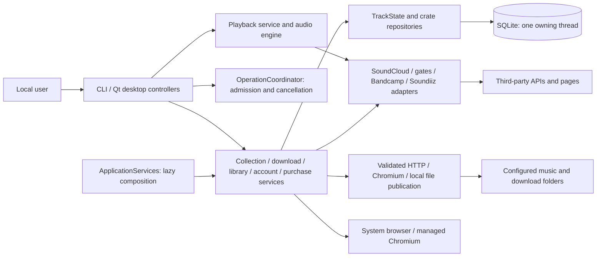

# PROJECT SPECIFICATION — dj-digger

- Status: current implemented system
- Document version: 1.1
- Product version verified: 1.2.1 (working tree)
- Owner: Filip Białogrecki
- Updated: 2026-09-27
- Document lines: <!-- SPEC TOTAL LINES -->1696<!-- END SPEC TOTAL LINES -->
- Section map covers through line: <!-- SPEC MAP LIMIT -->1696<!-- END SPEC MAP LIMIT -->
- Verified against: `pyproject.toml`, `dj_digger/`, `tests/`, `.github/workflows/`, `README.md`, and `CHANGELOG.md`

## Purpose of this file

This file is the durable source of truth for the product and system that are
implemented in the current repository. It records shipped behavior, component
boundaries, interfaces, persistence, security, privacy, integrations, and
verification. It does not contain a roadmap, target design, implementation plan,
or proposed feature. Agents use it to load only the context required by a task.

When this file disagrees with executable code, configuration, or tests, those
artifacts are evidence of the current state and this file must be corrected in
the same change. A behavior that cannot be confirmed in the repository is not an
implemented behavior.

## How to read this file

Never read this document end to end unless the task explicitly requires an
exhaustive audit. Instead:

1. Print only the metadata and generated map:

   ```bash
   python3 scripts/spec_section_map.py --print-map
   ```

2. Select only the sections relevant to the task.
3. Read only the mapped line ranges.
4. For a known endpoint, field, class, environment variable, function, table, or
   collection, use `rg` instead of scanning prose.

The following table is generated from numbered Markdown headings. Explicit
`spec-map-block` markers may expose selected blocks inside an unusually large
subsection; ordinary emphasized text is never promoted into the map.

<!-- BEGIN GENERATED SECTION MAP -->
| § | Section | Lines |
| --- | --- | --- |
| 1 | Specification governance | 114–142 |
| 1.1 | ↳ Authority and scope | 116–128 |
| 1.2 | ↳ Update contract | 129–142 |
| 2 | Product purpose and execution modes | 143–181 |
| 2.1 | ↳ Problem and product boundary | 145–158 |
| 2.2 | ↳ Execution modes | 159–181 |
| 3 | User-visible capabilities | 182–848 |
| 3.1 | ↳ Track collection | 184–208 |
| 3.2 | ↳ Link classification and exports | 209–227 |
| 3.3 | ↳ Track statuses | 228–236 |
| 3.4 | ↳ Audio preview | 237–361 |
| 3.5 | ↳ Downloads and local-file matching | 362–398 |
| 3.6 | ↳ Store purchase assistance | 399–484 |
| 3.7 | ↳ Local library, analysis and audio export | 485–639 |
| 3.8 | ↳ Qt Quick desktop | 640–848 |
| 4 | System context and data flow | 849–889 |
| 4.1 | ↳ Context diagram | 851–873 |
| 4.2 | ↳ Collection-to-library flow | 874–889 |
| 5 | Repository layout and component ownership | 890–957 |
| 5.1 | ↳ Entry, orchestration, and models | 892–903 |
| 5.2 | ↳ Network and external-system adapters | 904–920 |
| 5.3 | ↳ Persistence, local media, and UI | 921–957 |
| 6 | Runtime architecture and environments | 958–1069 |
| 6.1 | ↳ Runtime and dependencies | 960–981 |
| 6.2 | ↳ Concurrency and lifecycle | 982–1049 |
| 6.3 | ↳ Local paths and environment variables | 1050–1069 |
| 7 | Data model and persistence | 1070–1167 |
| 7.1 | ↳ Domain objects and identity | 1072–1086 |
| 7.2 | ↳ SQLite schema and invariants | 1087–1135 |
| 7.3 | ↳ Crate persistence and deletion | 1136–1151 |
| 7.4 | ↳ Configuration and credential stores | 1152–1167 |
| 8 | Public interfaces and contracts | 1168–1221 |
| 8.1 | ↳ CLI arguments and exit behavior | 1170–1194 |
| 8.2 | ↳ JSON and CSV summary input | 1195–1210 |
| 8.3 | ↳ URL-opening contract | 1211–1221 |
| 9 | Authentication and authorization | 1222–1267 |
| 9.1 | ↳ SoundCloud authentication | 1224–1246 |
| 9.2 | ↳ Gate action consent | 1247–1267 |
| 10 | External integrations | 1268–1410 |
| 10.1 | ↳ SoundCloud API and media | 1270–1281 |
| 10.2 | ↳ Link hubs and download gates | 1282–1351 |
| 10.2 · block | ↳ ↳ Hypeddit | 1290–1337 |
| 10.2 · block | ↳ ↳ Other resolvers | 1339–1344 |
| 10.2 · block | ↳ ↳ Network-write boundary | 1346–1351 |
| 10.3 | ↳ Browsers and clipboard | 1352–1363 |
| 10.4 | ↳ Bandcamp cart and Beatport playlists | 1364–1410 |
| 11 | Security requirements and threat model | 1411–1465 |
| 11.1 | ↳ Untrusted URLs and SSRF boundary | 1413–1431 |
| 11.2 | ↳ Secret and personal-data handling | 1432–1447 |
| 11.3 | ↳ File and mutation safety | 1448–1465 |
| 12 | Privacy, lifecycle, and retention | 1466–1510 |
| 12.1 | ↳ Data stored locally | 1468–1488 |
| 12.2 | ↳ Data sent to third parties | 1489–1500 |
| 12.3 | ↳ User-controlled deletion | 1501–1510 |
| 13 | Failure behavior and current limitations | 1511–1570 |
| 13.1 | ↳ Error isolation and reporting | 1513–1532 |
| 13.2 | ↳ Confirmed limitations | 1533–1570 |
| 14 | Verification, CI, and release | 1571–1665 |
| 14.1 | ↳ Offline and live test suites | 1573–1619 |
| 14.2 | ↳ Continuous integration and publishing | 1620–1650 |
| 14.3 | ↳ Specification-map verification | 1651–1665 |
| 15 | Evidence and operational references | 1666–1696 |
| 15.1 | ↳ Primary implementation evidence | 1668–1686 |
| 15.2 | ↳ User and historical documentation | 1687–1696 |
<!-- END GENERATED SECTION MAP -->

## 1. Specification governance

### 1.1 Authority and scope

This specification describes the Python package built from `dj_digger/` and the
repository mechanisms that test and publish it. The current product is a local,
terminal-native application. It has no repository-owned server process, public
HTTP service, inbound webhook, message broker, or remotely managed user account
database.

Normative evidence, in descending order, is executable code, test assertions,
packaging and workflow configuration, then current user documentation. Dated
design and implementation documents under `docs/superpowers/` are historical
context and are not evidence that a behavior is present.

### 1.2 Update contract

Any change to product behavior, component ownership, command-line or export
contracts, persistence, external writes, authentication, security, or privacy
must update the affected numbered sections in this file. After editing it, run:

```bash
python3 scripts/spec_section_map.py
python3 scripts/spec_section_map.py --check
```

The generator owns only the generated map and explicitly marked line-count
values. Hand-written content outside those regions is preserved.

## 2. Product purpose and execution modes

### 2.1 Problem and product boundary

`dj-digger` collects tracks behind SoundCloud playlist, user,
collection, and track links, extracts purchase and download destinations, and
presents them as a local playlist. It avoids relying on the finite set of tracks
rendered in a SoundCloud page by using SoundCloud API v2. Saved SoundCloud pages
are not an input.

The application helps the user inspect, open, download, classify, audition, and
remember tracks. Local music can be browsed, analyzed, collected into local
playlists and exported to a folder using documented deck audio profiles. It does
not format USB drives or generate rekordbox libraries. It does not purchase products or complete checkout. Gate and
store behavior is limited to the provider flows described in §§10.2 and 10.4.

### 2.2 Execution modes

The installed entry point is `dj-digger = dj_digger.cli:main`. The following
modes are implemented:

- `dj-digger [target]` assumes the `dig` command. The CLI is headless: it
  collects, exports, persists to the library, and prints a summary table.
  Without a target it exits with "Nothing to dig. Pass a SoundCloud link, or run
  dj-digger-gui to browse."
- `dj-digger dig [target]` accepts a SoundCloud HTTP(S) URL; anything else is
  rejected as not a soundcloud.com link.
- `dj-digger open SUMMARY` reads an exported JSON summary, displays it, and
  always batch-opens its links (prompting for a category unless `--category` is
  given; `--skip`, `--limit` and `--no-open` apply).
- `dj-digger auth ...` manages SoundCloud credentials.
- `python -m dj_digger` delegates to the same CLI entry point.
- `dj-digger-gui`, installed with the `gui` extra, starts the independent
  PySide6/Qt Quick desktop entry point, the only interactive UI. CLI startup does not import Qt.

The desktop is a local process. Network, disk scan, download, playback preparation,
cart, and batch browser work are process-local background workers rather than a
durable job queue.

## 3. User-visible capabilities

### 3.1 Track collection

For SoundCloud URLs, `SoundCloudClient.collect()` resolves the URL and handles:

- users and `/likes`, `/tracks`, or `/reposts` through paginated user endpoints;
- single tracks as one-track playlists;
- playlists/sets by collecting track IDs and hydrating them in batches of 50;
- an optional limit applied to collected tracks.

Hydration restores playlist order because the `/tracks` response is not assumed
to preserve it. Deleted or unavailable tracks omitted by SoundCloud remain
absent. Public API failures are surfaced as `SoundCloudError`; a 404 asks the
user to check the link and, for their own private playlists, to sign in to
SoundCloud first, since requests carry the stored OAuth token. The collection
client can also report the tracks gathered so far after each hydration batch or
page, already in playlist order; the desktop uses this to show an import as it
grows, and nothing is saved until the whole collection succeeds.

User repost collections use `/stream/users/{id}/reposts`; tracks and likes retain
`/users/{id}/{collection}`. The shared paginator unwraps track entries, preserves
order and duplicates, and rejects repeated next-page URLs rather than reporting
a truncated import as complete. Pagination retains API-host validation and
cancellation checks. HTTP errors identify the failed request without inferring
that every 404 means a private collection.

### 3.2 Link classification and exports

Each track is converted to one or more `LinkRecord` values. Candidate priority is
the structured `purchase_url`, then `extra_links`, then URLs in the description.
At most one link per recognized category is retained. Description links are
restricted to purchase/download categories to avoid collecting general promo
and streaming boilerplate.

The canonical category order is `soundcloud`, `no-link`, `bandcamp`, `beatport`,
`traxsource`, `junodownload`, `apple`, `shop`, `gate`, `smartlink`, `streaming`,
and `others`. Matching uses URL scheme validation and domain boundaries. A free
SoundCloud download is retained even when a store link exists. A track with no
usable link receives a `no-link` record pointing to its SoundCloud page.

Exports are `json`, `csv`, or `none`. JSON groups the compatibility object shape
by category. CSV columns are `category`, `artist`, `title`, `track_url`, and
`shop_link`. The default path is `soundcloud_links.<format>`. Current code reads
JSON summaries; YAML input is rejected with an explicit legacy-format error.

### 3.3 Track statuses

Statuses are `new`, `opened`, `skip`, and `got`. Opening a link promotes `new` to
`opened`. User marks are global by stable track key, so they appear across playlists.
Playlist refresh preserves locally removed track keys, marks newly arrived keys,
and sorts those arrivals above older active tracks while retaining source order
within each group.


### 3.4 Audio preview

Any track with a file on disk (library media, a download or a title-only match)
plays that file in both interfaces; only tracks without one stream from SoundCloud.
Local playback uses FFmpeg to produce 44.1 kHz stereo signed-16 PCM. Decoded
audio is retained in memory, up to 64 MB per source (about six minutes); once
that cap is reached the oldest audio more than 30 s behind the read head is
dropped first. A seek into retained audio moves the read head without a new
decoder; only a seek outside it starts FFmpeg again. A single decoder-control
thread handles repeated seeks; old generations cannot fill the new buffer. The audio callback only consumes
ready samples: underrun produces silence without advancing the media position,
while EOF and decoder failures remain distinct. Playback sources hold leases
until their decoder has actually stopped; prefetched files are also protected
from replacement. Local waveforms are generated independently after playback is
ready and cached in at most 128 files, each containing at most 1024 peaks.
The rendered waveform updates when these peaks arrive; pause and seek do not
discard them, while switching the loaded audio rejects obsolete results.
This playback PCM is never reused for analysis or export.

Playback is included in a normal installation through the core `miniaudio`
dependency. A missing or
unloadable decoder reports a damaged installation and asks for reinstallation,
not a separate audio dependency install.
`resolve_stream()` refetches track metadata. `policy=BLOCK` takes precedence
over `streamable=true` and any transcodings: it reports a SoundCloud account/region
restriction. No returned streams and unsupported stream formats are separate
errors. Non-streamable tracks and snippet-only policy are also rejected.
Resolution prefers a progressive MP3 transcoding and falls back to MP3
HLS when progressive MP3 is absent. It authorizes the chosen transcoding and
returns its protocol, signed URL, duration and waveform location. Playback
refusals log the numeric track ID, known policy, stream count and reason without
signed URLs or tokens.

The audio worker resolves the stream, fetches the waveform, and opens the HTTP
source before handing the track to the UI thread, so no connection is opened from
the interface thread.

Audio is decoded from an HTTP source and is not persisted to disk. A declared
source at or below 50 MiB is buffered progressively in memory; larger or
undeclared sources stream directly. Range requests support seeking. A seek in
an MP3 of known size (a progressive source, or an HLS track once every segment
arrived) opens the decoder at the byte proportional to the target after any
ID3v2 tag, through a view of the source that starts there, instead of letting
miniaudio decode every frame before the target; it takes about a millisecond at
any position and lands within tens of milliseconds on constant-bitrate MP3.
Other sources keep the decoder's frame seek. The output device uses 50 ms
periods. Pause only stops the device, so resuming continues what it had queued;
seek and stop close it and the next play opens a fresh one, so audio queued from
the old position or track never plays after the jump. The first 10 ms after
every start fade in. While audio is fed, `beats.py` detects bass transients from
queued PCM before volume scaling. `KickDetector.feed(chunk, start)` takes the
track time of the first frame, so its clock follows the playhead even when a
source reports fewer frames than it sent. Every 10 ms it takes a 512-point
Hann-windowed FFT of stereo PCM averaged down to 11.025 kHz (46 ms window).
Channel powers are combined without cancelling opposite stereo phases. Positive
spectral changes are measured against a five-bin frequency maximum of the
previous spectrum, so moving bass harmonics contribute less than fresh attacks.
The detector compares 30-180 Hz novelty with 180-1500 Hz novelty and energy.
Its threshold follows the last 0.6 s of attacks rather than total bass loudness.
A candidate must rise sharply and clear a small noise floor. A 0.5 % full-band
rise, or a 30-180 Hz level at least 15 % above its lower value of the previous
two hops, rejects constant-power sweeps; the bass-level rise keeps a kick whose
click fades while its body swells, leaving full-band power flat. A large
full-band attack can also confirm a weaker spectral change. The hit must be
bass-led: at its attack (bass novelty at least half the 180-1500 Hz novelty and
bass level at least a quarter of the 180-1500 Hz level) or at any hop of its
body (bass level at least the 180-1500 Hz level), so a clap or snare on the kick
does not hide it while a lone snare stays rejected. Neither a 10 %
full-band rise nor a subsequent RMS decay is mandatory, allowing heavily
limited kicks to register. Sub-bass-centred changes use stricter attack contrast;
the relaxed threshold for overlapping roll attacks applies only above a 75 Hz
novelty centroid and within 180 ms of a confirmed hit. Hits remain at least
60 ms apart. A local peak is confirmed one analysis hop later and timestamped
at the window centre. A stronger peak confirmed within 60 ms of a waiting hit
takes over its time, and a waiting hit is held while the bass novelty is still
rising above it (up to 80 ms after its attack), so the leading edge of a kick
never stands in for its attack. The hit is then published four hops (40 ms) later with its
`level`, the highest 30-180 Hz level from the attack through those hops, because
a kick's body peaks 40-60 ms after its attack while a sidechained sub is still
ducked, whereas a bass stab is loudest at its attack. There is no additional
decay-confirmation wait.
Output-buffer and UI delivery latency still depend on the device.
Strength follows the square root of the attack's share of recent peak novelty.
This is onset detection, not instrument separation: an abruptly started bass
note can produce one pulse, percussive synth bass can resemble a kick, and
masked kicks can still be missed. A held tone or changing pitch must not create
an ongoing predicted roll.

`PulseHistory` publishes an immutable, bounded history of detected hits, with
no BPM warm-up, predicted grid or persistent roll charge. Each hit's amplitude
is its `level` against a reference that is the loudest level of the last two
bars (eight beats of the track's BPM when known, else 4 s; exponential decay,
floored at a fixed noise level): `(level / reference - 0.6) / 0.4` clamped to
0-1, so a bass stab at 75 % of the kick pulses at 0.4, one below 60 % is not
published, and a quieter section regains full amplitude within two bars. The first detected
kick is available after its short analysis window, without waiting for tempo; a break produces no invented
beats, and rolls flash at their actual detected spacing. A new decoder or seek
clears the history but keeps the reference; a pause retains queued audio and its hits.
`Player.beats()` returns detected (track time, amplitude) pairs from 0.5 s behind
the decoded position to that position, plus the seconds per beat: the track's
BPM when known, else the median 0.25-1 s gap between recent hits, else 0.5.
Waveforms are cached in memory for the process.

MP3 HLS VOD manifests and each redirect/segment are restricted to HTTPS
SoundCloud CDN subdomains, without credentials in URLs or nonstandard ports.
Segments are fetched in order on a background thread into a seekable in-memory
MP3 buffer, capped at 50 MiB; oversized streams fail explicitly. Manifests are
capped at 1 MiB and 10,000 segments. Incomplete, encrypted, master, byte-range
and non-MP3 container playlists are refused. Transfer failures remain errors,
not successful EOF; closing releases the response and stops further requests.

The next visible track is prepared during the last 20 seconds of playback. A
filter change discards preparation that no longer matches the next row. Tracks
advance automatically at end of stream. Playback follows the selected playlist
occurrence, so repeated track IDs advance past their own row instead of looping
back to the first occurrence. Missing `miniaudio`, an unavailable
audio device, a backend that refuses to start or stop an open device, bad media,
or a missing track ID produces a user-visible degraded state rather than
terminating the application. A device that fails after having worked is closed and
rebuilt on the next attempt rather than disabling playback for the session.
Decoder EOF and failures become generation-tagged playback events inside the
audio callback, so neither escapes through CFFI. Events from a generator made
stale by stop, seek, unload, or a new load are ignored. At the end of the visible
list the final track stays loaded; pressing play again starts it from the beginning.

### 3.5 Downloads and local-file matching

The selected track or all eligible visible tracks download into a playlist-named
subfolder of the configured directory in the desktop. It uses
`paths.playlist_download_directory`: expand `~`, replace invalid filename
characters, collapse whitespace, trim dots/spaces, and limit the
folder name to 120 characters. A blank title uses the configured directory;
an already matching final directory name is reused case-insensitively. The
destination is captured for the operation, including gate completion and copies
of existing local files. Resolution priority is a selected gate, an explicit
artist download URL, then the authenticated SoundCloud download endpoint.
Finished files are atomically renamed from a `.part` file to a sanitized,
collision-free filename. Recognized suffixes are MP3, WAV, FLAC, AIFF/AIF, and
ZIP. HTML responses are rejected as files, redirect hops are bounded at five,
and the maximum body size is 2 GiB.

Batch downloads use at most eight worker threads. Each gate flow uses its own HTTP
session because cookies are flow state. Prerequisites such as a real profile,
SoundCloud login, or manual Hypeddit browser completion are collected and retried
at most once by the desktop flow. Completed downloads store their local path and mark
the track `got`.

The local scanner recursively indexes configured directories for MP3, WAV, FLAC,
AIFF, M4A, AAC, OGG, and ALAC files, following symbolic links, and caches path,
modification time, size, and normalized filename data in SQLite in batches of
200 rows per transaction. Automatic scans log inaccessible folders at DEBUG level
without an error banner; explicit explorer access reports errors. Cancellation
stops the walk between files while keeping what was already written. Artist-plus-title matches are confident and
may set `got`; title-only matches require at least six normalized characters and
only attach a path: both interfaces show it and preview that file locally, and
Download never treats it as an owned file. A unique filename may contain extra text around the matched
artist/title, such as a mix label; ambiguous decorated matches are rejected.
Missing files are removed only after a complete readable parent listing on the
known volume; inaccessible or replaced roots retain their records. Directory
inode/device tracking prevents symlink cycles. Only file-provenance `got` marks
are eligible for clearing.

### 3.6 Store purchase assistance

Store assistance is explicitly initiated by the user. Bandcamp uses verified
cart automation; Beatport produces a playlist for a supported transfer instead
of attempting to log in or mutate a cart. The desktop owns one lazy persistent
Chromium profile for its lifetime and drives it headless, out of sight, for
product discovery, revalidation, and mutation with at most two managed work
pages. A window appears only when there is something for the user: the
completed cart view and the manual-finish step open a separate visible browser
carrying the hidden session's cookies, so the profile is never switched
between modes; a desktop display is needed for those two steps only. The
Settings login opens the profile itself headed for the login and returns it to
hidden use afterwards, retrying a still-locked profile a few times.
Bandcamp cart continuity depends on the persistent cookie jar and does not
require an account login. Settings can open or inspect the Bandcamp session and
explicitly reset the dedicated store profile.
`P` opens every exact Beatport track page among the targeted rows in the
configured regular browser (release links are counted and skipped), with the
same confirmation threshold as bulk open, because Beatport carts are not
automated. With no store filter, Bandcamp is preferred and Beatport is the
business-level fallback. When both filters are explicitly active, the desktop emits independent
requests so a successful Bandcamp addition does not remove that track from the
Beatport playlist.

Two asynchronous page workers preflight a batch. They resolve an exact product,
check individual availability and price, verify current cart membership, and
return an editable plan. A single fixed-price track may proceed directly from
the explicit `c` action; batches and flexible Bandcamp prices require the plan
screen. The user may deselect items and press `E` to raise a Bandcamp price from
its verified minimum in store-declared steps only when the store exposes an
editable price. The review table shrinks to preserve its action buttons in short
terminals and accepts `Y`, `Enter`, or a button click to continue. A canonical
Beatport `/track/<slug>/<numeric-id>` link becomes an exact playlist entry
without starting Playwright. Release links use read-only lookup, retain an exact
track URL when one is available, and fall back to artist/title metadata when a
changed page or security challenge prevents exact discovery.

Before each mutation the page is reloaded and product identity and price are
compared with the preflight snapshot. Ambiguous matches, version mismatch,
changed price or product identity, unavailable controls, external redirects, or
failed cart verification skip or fail the affected item. An add is not retried
when its verification is uncertain. Bandcamp verification runs three stages on
their own clocks (the cart count for 5 s, the real side-cart control requiring a
visible removable row with the same canonical host and path for 10 s, one
reload check for 25 s) inside a 45-second budget, and an unverified result names
the stage it gave up at. An unverified click or a structural failure saves a
screenshot and a redacted page copy (script bodies and query strings removed)
under `cart-diagnostics` in the data directory, keeping the last ten. After two
unverified clicks in one store the batch stops clicking: the remaining products
are opened with Buy expanded and the price filled, the desktop asks the user to
press Add to cart themselves, and one read-only cart check per item records
`manual` or a manual failure. The result screen offers the same for items a
batch left uncertain. A user-raised price is filled into Bandcamp's current price input
or fails before the add click; it is never silently discarded. A still-uncertain
page remains open for manual inspection. The flow leaves verified carts open for
the user while releasing the batch worker for another request; a failure to
show the final cart window is reported as a warning and never discards the
verified additions. Mutation is serial within each store,
cancellation after a click waits for one bounded verification, and repeated
structural failures open a per-store circuit breaker without
navigating the rest of the queue. Results group identical root causes and mark
only failures that are safe to retry. Approved Beatport items and safe Beatport
lookup fallbacks are reported as playlist-ready, not as cart failures. The
result action writes a new, non-overwriting plain-text playlist in the playlist's
download folder and copies its entries to the clipboard. It also sends the
accepted titles and artists, with Beatport preset as the destination, to
Soundiiz's public playlist-import endpoint and opens the returned HTTPS review
URL in the configured regular browser. The response URL must remain on
`soundiiz.com/go/import-playlist/`; imports are limited to Soundiiz's documented
1–200 tracks. Above 200 no request is sent; the saved playlist file remains and the
limit is reported apart from other import failures. Promo prefixes, uploader names, preview markers, trailing label
fields, and `OUT NOW` markers are removed from SoundCloud metadata when its title
contains an explicit `artist - title` pair, including missing whitespace around
the separator. Featured performers and remixers named in the cleaned metadata
are also sent as Soundiiz artists to improve catalog matching. Exact Beatport
URLs are written to the local file when
known and replace that track's stored Beatport release link in the current
playlist; release and label URLs are never persisted as exact matches. Other
rows use the cleaned `artist - title`. Match review, transfer approval, payment,
and checkout remain manual.

Cart results translate internal statuses into readable labels while preserving
machine-readable status/reason codes. Unknown statuses remain explicitly unknown.
The result table is sized to the batch and available height, with actions in a
two-column grid; track labels and reasons are rendered as literal text.

### 3.7 Local library, analysis and audio export

The sidebar has playlists above a lazy directory explorer, initially 50/50.
Both section headings are centered and use the same muted text color.
Saved splits are 30/70, 50/50 and 70/30; `ctrl+r` switches visible sections,
including on short terminals. Pins, configured directories, downloads and mounted
volumes form the roots. `ctrl+f` opens any explicit directory; `ctrl+n` cycles
250-file pages. The explorer uses one-cell scrollbars, with the horizontal
thumb drawn as a thin underline retaining native click/drag behavior, and a one-line
“+ Open folder” button matching “+ Add playlist”. Shortcut hints and file counters
are omitted; a compact “Next page” button appears only for multi-page folders.
Names load before metadata; no audio analysis or content hashing
runs just because a directory is opened. At most 1000 immediate subdirectories
are shown per expanded tree node; additional paths can be entered directly.
Local rows do not require a `LinkRecord`. `ctrl+l` creates/appends a local playlist.
Automatic scans skip inaccessible folders without an error banner; explicitly
opening an inaccessible folder reports the access error.
The clickable footer switches to local actions for folder/local-playlist views:
Convert, Analyze BPM/key, Analyze folder, Play, Remove, Select and Edit BPM/key, with secondary actions
omitted when space is limited. The store legend and shop commands are hidden in
this context; SoundCloud views restore them. Stop appears during an operation.

Clicking Analyze BPM/key (or `j`) immediately analyzes the selected local files,
or the highlighted file when none are selected. `Shift+J` / Analyze folder covers
all immediate audio files in the open folder, ignoring selection, filters and
pagination; it does not recurse into subfolders. No analysis confirmation is shown.
The BPM/key edit dialog shows the independently resolved source for each field:
Manual, Analysis (estimate), File tag or Not available. It shares value-resolution
logic with local row hydration and ignores analysis from a different file
signature. Sources remain presentation data, outside serialized Track values.
The dialog loads through the application IO worker and ignores stale view results.

Local folder and local-playlist views always show BPM and Key, including stored
results on first opening without reanalysis. This does not change the optional
column preferences used by SoundCloud views. Starting analysis checks for the optional
analysis dependency and FFmpeg before starting. Missing dependencies produce an
installation hint rather than repeated failures for each track.
Analysis uses optional librosa in one fresh Python subprocess with explicit pipes
and bounded JSON output. It does not inherit multiprocessing resource-tracker
descriptors from the host process's captured stderr. Cancellation terminates and reaps the
analysis process group, including FFmpeg, before deleting its temporary workspace.
The algorithm uses continuous
FFmpeg resampling and overlapping STFT frames (`center=False` semantics), one
global onset envelope and aggregated chroma. Channel powers are combined before
feature aggregation to avoid anti-phase cancellation. Feature envelopes use a
temporary disk file rather than keeping decoded audio in RAM. Automatic results
are estimates; no confidence percentage is claimed. `ctrl+k` edits BPM/key and
supports tempo ×2/÷2 plus classical/Camelot choices. Manual values, current
analysis, and source tags are stored separately with that priority. Cache checks
include file signature, SHA-256, algorithm version and parameters. Audio tags and
rekordbox data are never written by analysis.
Results include separate missing-key and missing-tempo reason codes. Analysis
version `onset-chroma-2` invalidates older cache entries when analysis is requested
so these reasons can be recomputed. Per-file errors retain the analyzer traceback
in the diagnostic log. Missing BPM/key results also log their per-file reason at
INFO level. Completion shows a short notification with keys found, no clear key,
and processing errors, without opening a summary panel. A private JSONL file is
streamed during work, then atomically replaces `last-analysis.jsonl` in the default
log directory; cancelled/failed runs retain completed rows and their termination
status. Report publication failure retains the previous report and is reported
explicitly. No-key results are not counted as processing errors. Manual corrections
remain independent of automatic results recorded in the diagnostic file.

In an explorer folder, `x` / Remove asks for confirmation with the selected file
paths (or the highlighted file) and permanently deletes those files from disk.
A folder page shows one row per file: a symbolic link to a file on the same page
folds into that file's row. A selected symbolic link is refused before confirmation;
every confirmed file is revalidated before any is deleted, so a changed file or
loaded/prefetched audio stops the batch with nothing removed. Deletion
marks central media records unavailable and clears cached file mappings, while
preserving playlist references and manual metadata. A database failure after
unlink is reported explicitly; filesystem and database updates are not atomic.
In saved playlists, Remove retains its existing playlist-only, undoable behavior.

Convert (`ctrl+e`) asks which decks the files must play on, plus the destination,
then constructs a frozen export plan and shows a review before execution. The
format is not chosen by hand: `decks.best_profile()` picks FLAC when every chosen
deck reads FLAC and WAV otherwise, capped at the highest bit depth and sampling
rate all chosen decks list for PCM (for example FLAC up to 24 bit/96 kHz for
CDJ-3000 with OPUS-QUAD, FLAC up to 48 kHz once an XDJ-XZ joins, WAV up to 16
bit/44.1 kHz with an XDJ-AERO). Decks that play exactly the same files (the
same MP3, AAC and PCM rates, bit depths, lossless codecs and MPEG-2 AAC rule;
file systems may differ) share one box, `decks.DECK_GROUPS`, ten groups laid
out two to a row; ticking one chooses all its decks, and a group starts ticked
when any of its decks was chosen before. The dialog shows the resulting format
as groups are ticked and needs at least one. The chosen decks are remembered as
`export_decks` in the shared configuration and saved in the plan, so resumed
plans and their reports keep them; before a choice is saved, and for plans saved
before this, the set is CDJ-350, 850/850-K, 2000, 2000NXS, 2000NXS2, 3000 and
3000X. Exports copy every selected audio
file to a unique new folder, including unchanged files. An unselected folder view
covers all matching pages; recursion is explicit. A file is kept as it is only
when every chosen deck plays it according to the rules below; PCM and, for a FLAC
target, FLAC/ALAC otherwise convert to the target, while a lossy file some chosen
deck cannot play is listed as an exception rather than transcoded. Only necessary
conversions run.
No automatic upsampling, downmix or normalization is performed. Nonstandard
sample rates, ambiguous streams, clipping and unsupported parameters are reported
as exceptions. Known text metadata is preserved where the output muxer supports
it; supported FLAC artwork is copied, other omitted metadata is reported.

Versioned rules (`RULE_VERSION`; a plan made under other rules must be prepared
again) transcribe the USB playable-file tables of the operating instructions, each
deck citing its manual in `decks.SOURCES`: CDJ-350, 850/850-K, 900, 2000, 900NXS,
2000NXS, 2000NXS2, TOUR1, 3000 and 3000X; XDJ-700, 1000, 1000MK2 and AERO; and the
all-in-one XDJ-RX, RX2, RR, XZ, RX3, OPUS-QUAD, XDJ-AZ, OMNIS-DUO and XDJ-AN. Per
deck they hold the MP3 and AAC LC sampling rates (MPEG-2 Layer-3 at 16-24 kHz with
8-160 kbps from the CDJ-900 on and on the XDJ players; no 32 kHz on the CDJ-3000
generation and the newest all-in-ones; 44.1 kHz only on the XDJ-AERO), the PCM
rates and bit depths, and which of FLAC and ALAC are read. The CDJ-350, 850, 900,
2000 and XDJ-AERO list MPEG-4 AAC LC only, so a raw ADTS `.aac` file, which may be
MPEG-2 AAC, is unverified on them. A file outside a table is incompatible because
it is not documented, not because it was tested. The rules also hold each deck's
USB file systems (FAT16/FAT32 on all, HFS+ on all but the XDJ-RX, exFAT only on
the CDJ-3000X, XDJ-RX3, OPUS-QUAD, XDJ-AZ, OMNIS-DUO and XDJ-AN, NTFS on none) and
the eight folder levels every manual shows. Planning finds the mount point of the
destination and its file system (`/proc/self/mounts` on Linux, `stat -f %T` on
macOS, `GetVolumeInformationW` on Windows); when it is FAT, exFAT, HFS+ or NTFS
the plan carries warnings, shown in both reviews without blocking, for chosen
decks that cannot read that file system and for planned files more than eight
folders below the drive root. Other or undetectable file systems, such as an
internal disk, produce no warning.
Both profile compatibility and actual-set compatibility distinguish documented
compatible, incompatible and unverified files. These are audio rules, not proof
of device testing or of USB filesystem support. WAV output is canonical RIFF PCM
with checked chunk sizes, alignment and sample identity for lossless transforms.
New files undergo full decoding and length/parameter verification; copies also
undergo byte hashing. Classic RIFF and FAT32 file-size limits are enforced.

Export options keep Review/Cancel outside scrolling content. Review names the
target format and shows actual-set compatibility for the chosen decks only, and keeps
Execute/Cancel plus the replacement warning visible. Button handlers accept only
the explicit primary action; Cancel/Escape never authorize execution. The first
200 plan entries remain visible with the complete report available separately.

Replacement is never a remembered default. A durable per-file journal records
preparation, temporary-original preservation, installation, database commit and
cleanup. Installation uses platform-exclusive rename rather than overwriting
foreign files. Symbolic/hard links and playback leases prevent replacement.
Cancellation is cooperative during preparation and between files; commit settles
without interruption. Startup recovery compares content hashes, completes or
restores unambiguous states and preserves ambiguous ones. Successful replacement
leaves no lasting backup. Directory fsync is used where supported; this is not a
cross-filesystem transaction or guarantee against storage power loss. New-folder
exports keep partial results and a complete report; `ctrl+u` resumes the most
recent unfinished operation from the application's trusted SQLite journal.

`i` imports playlists created by a SoundCloud profile independently of
profile-track digging. Private mode checks `/me` ownership and session identity.
Pagination detects repeated cursors; track hydration is batched with a bounded
cache and preserves duplicates/order. Missing tracks or incomplete replies retain
the previous snapshot. Provider playlist IDs preserve identity across permalink
changes; local deletion generations suppress stale results. Mass import performs
no external gate/hub resolution.

### 3.8 Qt Quick desktop

The optional desktop uses PySide6 and a QML `ApplicationWindow`. The
playlist/folder sidebar spans the full window height; the waveform and transport
sit above the virtualized track table beside it. Status is the first table column, and the BPM/key columns
appear only in local views. Transport buttons use SVG icons with accessible labels and tooltips. The window icon is the packaged application icon (`gui/qml/icons/app.png`, 256 px: a record carrying an artwork-style barcode seeded from `dj-digger`, with a white label, on a blue-to-bordeaux tile; `scripts/app_icon.py` draws it and writes the same design to the Windows `.ico` and macOS `.icns`), so the title bar and taskbar show it alongside the executable's shortcut icon. The desktop file name (the Wayland app_id) is `dj-digger`, so a Linux desktop entry named `dj-digger.desktop` supplies the dock name and icon of the open window; the repository does not ship that entry. The desktop waveform rises
from the bottom edge of its panel, never mirrored, filling the space down to the
transport row; the desktop uses the same averaged, normalized envelope and
level curve in `waveform.py`. Desktop bars share one vertical gradient from
bordeaux at the bottom to blue at the top of the panel; the unplayed layer draws
it with reduced opacity (0.38 dark theme, 0.45 light theme), and a 2 px playhead
in the foreground colour is placed at subpixel precision without a glow. While a track plays, a 25 ms backend tick sends a
small audio snapshot and, when it differs from the last one sent, a `beats` event (key, pulses, period) containing actual
hits from queued audio with their amplitudes and the seconds per beat. Table cells and transport state bind to the
bridge's `audioKey` and `playing`, which change only when the track or play state does, and the waveform bar levels
are recomputed only when the bar count (one per 3 px) changes; bar canvases repaint 50 ms after a resize settles.
The window schedules these as they are heard:
- Clock: it follows audio position between ticks. A new key, resume or jump
  over 150 ms re-anchors it; smaller differences ease by a quarter. Scheduling
  never advances past the latest decoded position. While a track plays with
  animations on, each frame also moves the playhead to this clock minus the
  pulse timing, so it slides with the heard audio instead of stepping with the
  snapshots; paused, or with animations off, it shows the snapshot position.
- Flash: a `FrameAnimation` calls `pulseTick`. View → Pulse timing compensates
  for the output queue (0-400 ms, default 70, in 10 ms steps; saved values remain
  unchanged). A detected timestamp flashes at most once, including across a
  pause/resume at the same position. Hits up to 100 ms late
  can still flash, including the first queued attack; older hits are skipped.
  Events from another track are ignored.
- Envelope: one `flash` scalar (0-1) drives every glow. A hit rises from the
  current value to its amplitude over 25 ms, holds 40 ms, then releases
  exponentially with a time constant of 0.3 × the event's `period`, bounded to
  90-180 ms, so the glow breathes with the kick and is nearly gone by the next
  beat. A hit never adds to a running flash: it raises the peak at most. A hit
  under 100 ms after the previous peak merges into it without a new attack, and
  a hit within half a beat of the last one shown is scaled to 0.6, so kick rolls
  read as one swell with the main kicks accented. A clock re-anchor clears the
  envelope.
- The waveform and the artwork keep their normal base colours, including
  while paused. A hit crossfades the played region of the waveform and the
  artwork backdrop toward their peak colours; the unplayed region never pulses.
  Peak colours keep the hue with saturation + 0.3 and lightness + 0.06 (dark
  theme) or + 0.08 (light theme); a red (linear R ≥ 70 % of R+G+B, the bordeaux
  tones) only lightens, by 0.02 (dark) or 0.03 (light). The peak bars also cast
  a 12 px halo in the peak accent colour at 90 % alpha, painted once with the
  layer. The peak layers reach full opacity at `flash` = 1. Each palette tone's
  base/peak pair stays under the WCAG 2.3.1 general flash threshold (relative
  luminance change below 0.1) and red flash threshold (red value change below
  20); the offline GUI test asserts both in both themes.
- Disabling animations stops flashes and clears the clock.

The loaded track fills a Now playing header in the player panel: a large title,
the artist, BPM and key chips, and generated artwork, never fetched: a record on
a two-tone gradient with normal blue/bordeaux swatches (no darkened variants),
both picked from a hash of the track key. The record is a flat near-black
(`#0c0c0e`) with a label in the hashed tone darkened by 25 %; the record never
pulses. Its
surface carries a barcode of the track: 18 to 27 radial marks spread evenly
around the record, each placed at random within its own slot, spanning the
whole groove, its inner or outer half, its middle, or its thirds with a gap,
with dots, laid out by a seeded generator so a track always draws the same code. The record turns
while the track plays; with each beat flash the backdrop gradient crossfades
toward its peak colours. The backdrop is never dimmed. The artwork is hidden when the panel is narrower
than 640 px. These
details arrive in a separate `nowPlaying` event when a track loads or its rows
refresh (for example after analysis or an edit), not in the position snapshots.
The palette is near-black (light theme: silver-grey) with an electric-blue
accent, a bordeaux second accent and silver secondary text. Selected rows,
playlists and folders use a soft low-chroma blue (dark `#34466f` with white
text, light `#c9d5f2` with near-black text), and chips on a selected row sit
on the panel colour; clocks, BPM and
counts use tabular digits. In local views BPM and key render as chips; BPM shows
one decimal place when fractional. Keys are parsed from common spellings (`Am`,
`A minor`, `Amin`, `8A`, enharmonic sharps/flats) by `analysis.key_names`, shown
in Camelot or classic notation (View → Key notation, default Camelot), sorted
around the Camelot wheel with unrecognised keys last, and tinted with one of
twelve wheel hues. A key chip is ringed when it mixes harmonically with the
playing track (same key, one step around the wheel, or the relative
major/minor) and a BPM chip when it is within 3 % of the playing tempo; the
playing row itself is never ringed.
Motion is on by default and View → Animations turns all of it off: rows fade to
a hover surface; a status change flashes its rows (success colour for owned,
muted for skipped, accent otherwise; not for more than 100 rows at once, and also after a sort or
filter rebuilt the rows); download fills carry a sweeping highlight only while
an operation runs; the play button pops when its icon changes; the player panel
switches height at once and its artwork and waveform fade in (180 ms); a new track's waveform rises from
the bottom; the waveform and artwork keep their base colours, and detected kick flashes
are part of this motion. Theme changes and recycled table delegates
are not animated. Space always belongs to playback, wherever focus
is, except while typing in a text field or inside a modal dialog: it starts the
selected track, toggles it when it is the one loaded, or toggles the loaded track
when nothing is selected. The transport Play button uses the same selection
rule, and its icon/label describe the selected target rather than a different
loaded track. The read-only folder explorer starts with the system Downloads and
Music locations from `QStandardPaths`, plus previously saved additional folders.
The home directory is not a default root. “Add folder…” (also Ctrl+O) validates,
saves, and opens a chosen directory using `pinned_directories`; duplicates are
shown only once. Each root has a native Qt `TreeView` backed by the shared `gui/directories.py` `DirectoryModel`/`QFileSystemModel`. Both sidebar sections use a left-aligned uppercase header with a “+” button (Add playlist, Add folder…) instead of full-width buttons under the lists. Root rows and tree rows share one 28 px row style: a small chevron that turns when expanded, a folder icon, 16 px indentation per level, a hover surface and the accent selection background; rows without visible subfolders show no chevron. Native hidden directories
and dot-prefixed directories are excluded, including on Windows. Qt background
enumeration checks visible subdirectories before showing an expansion arrow;
folders with only files or hidden subfolders remain selectable leaves.
Large expanded roots have a bounded, scrollable tree viewport. Selecting a folder opens its tracks in the paged table, and the page range appears only for folders above one page. Root and tree rows highlight only the folder whose tracks are loaded (paths compared after normalization), so opening a playlist clears the folder highlight. It provides
search, store filtering with per-store counts derived from the loaded view,
hide-handled filtering, stable-key selection, numeric sorting with a header
arrow, resizable columns, keyboard navigation and native clipboard copying. The title column absorbs the remaining width so status and store columns stay on screen at the default window size, unless the user has dragged or fitted it. Dragging a header divider resizes that column and the width provider honours the explicit width. Double-clicking a divider fits the column to its widest visible value or header; the divider strip does not sort. Right-clicking a header opens a column menu with Fit column to contents, Fit all columns, Reset column widths, Reset column order and a checkable entry per column; the title column cannot be hidden and BPM/key stay unavailable outside local views. Dragging a header moves the column; delegates, widths and sorting keep their logical column, and the visual order is restored at startup. Rows are never reordered: every model reset drops the row mapping that Qt 6.11 freezes when a column moves, which otherwise aborted the app when a larger view loaded, while the column order stays. Status cells use the status glyphs, followed by a word except for `new`
(`·`, `○ Opened`, `✓ Got`, `✗ Skipped`), coloured muted for new and skipped,
success for owned and warning for opened. Store cells render badges, except
`no-link`, which is plain muted text; local files and the playing track carry markers, a
continuous progress fill spans the full row background while downloading, with
the percentage in the Status column and text drawn above the fill. The fill
follows column widths and horizontal scrolling; selection remains visible in
both themes. The search field spans the full width of the track pane. Beneath it one toolbar row holds, whenever a view is loaded, flat icon buttons for Open links, Download, Mark owned, Skip, Analyze BPM / key (local views only) and More actions, followed by the store filter and Hide handled; buttons that need a selection are disabled without one. More actions opens the row context menu without the entries already on the toolbar. In both forms the menu shows BPM/key editing, audio export and file deletion only in local views and Remove from playlist only in playlist views. Below 1040 px of toolbar width these buttons show icons only; tooltips name the action and its shortcut. A status bar spans the whole window below the sidebar and the table with visible/total/owned/skipped counts on the left, the busy indicator, a Cancel button during operations and the last message; during a playlist import the message shows the stage with done / total counts beside a progress bar, at most ten updates a second. Add playlist asks to paste a link to a SoundCloud playlist and re-opens with an error until the text is a soundcloud.com link. The import is listed at the top of the playlist sidebar at once, with a spinner and the link as its name until SoundCloud reports the title, and cannot be opened from there; the table opens on it and fills batch by batch in playlist order. These provisional rows are not saved: when the import succeeds they are replaced by the saved playlist, and when it fails, is cancelled or finds nothing the view is withdrawn and the sidebar entry disappears. Refresh keeps the current rows until the new ones are saved. The menus are Library, Tracks (open, download, status, undo, remove), Playback, Tools (BPM/key analysis and overrides, audio export, file deletion, link export, cart), View (search, hide handled, select all, sidebar, language, theme, key notation, animations), Settings (preferences, accounts) and Help. Every menu entry, including the row and playlist context menus, uses one layout: a fixed check column, the label and the shortcut in the muted color, and menus size to their widest entry after retranslation. Space is the shortcut of the Play / pause action. Single-key shortcuts (add, refresh, open, download, got/skip/reset, undo, remove, search, hide handled, seek, next/previous, volume, mute, sidebar) and are listed in a generated Help dialog; they are suppressed while text fields or modal dialogs have focus. Actions that need a selection are disabled without one;
whole-view variants (open all visible, download all visible, cart for all
visible) are separate explicit commands, and bulk opening asks above twenty
links. Errors appear in a separate, dismissible banner with a
Details button opening the message log. Later informational messages do not dismiss an error; closing
the banner retains it in the log. Informational messages remain in the footer.
The transport collapses to one row when nothing is loaded, shows m:ss clocks, a position cursor, hover
time, drag seeking and a mute toggle drawn as a speaker icon that is struck through while muted (its
Mute/Unmute name stays in the tooltip and accessible name). The waveform arrives in its own event once per loaded track (again
when a local envelope is ready) and is painted in cached normal and peak layers; progress moves a clip edge and the
cursor. The 25 ms position snapshots carry only key, title, state, position and duration and
notify audio bindings alone. Dragging on the waveform shows the pointer's time and sends one seek on
release; the target stays displayed until the backend confirms the position or 1.5 s pass. Play/pause
and seeks publish a snapshot as soon as they are applied; seeks arriving faster than the decoder serves
them collapse to the newest, and nudges queued behind one add up.
Dialogs size to their content, share the panel surface with a compact title, and place normal-sized buttons on the right; Cancel and Close use the application catalog rather than the Qt base translation, which the frozen bundle does not carry. Forms use choice lists for enumerated values,
numeric validators, framed multi-line editors, labelled checkboxes, inline
folder/file pickers and a monospace read-only view for logs and plans; the
confirming button carries the action name. Validation runs before a form
closes: an invalid answer re-opens the same dialog with the entered values and
the error message instead of discarding the input.
Language selection supports English and Polish UI catalogs; provider diagnostics
and some service-generated summaries retain their original text. Themes support
system, light and dark, with the current language, theme, key notation, sidebar
and animation state checked in the menus. The application palette covers alternating folder rows,
input placeholders, control indicators, disabled text, popup states and tooltips;
selected rows pair their foreground with the selected background in both themes.
Playlist and pinned-folder selection explicitly pair the accent background
with selection text in both themes. At the 760×520 minimum window size, sidebar width is constrained to leave room for transport controls, volume is flexible, and the selection bar keeps to one icon-only row. The track table retains horizontal
scrolling for columns that do not fit.
Window dimensions, column widths, hidden columns, column order, sidebar width and visibility, language, theme, key notation, the animation switch and the pulse timing persist privately in `config_dir()/gui.json`; unknown keys are dropped when saving and values are validated when loading. The playback level is a shared `volume` field in the
common configuration: the runtime applies it when the player is created and
saves it on shutdown, so the desktop starts at the level last set. Existing data, credentials and configuration paths stay
unchanged on every platform.

Desktop actions use the existing services for collection/refresh/profile import,
summary import/export, playlists, status/undo, local folders/scanning, downloads,
BPM/key analysis and overrides, reviewed audio export/recovery, SoundCloud login,
store login and cart preflight. Browser links select one eligible destination per
track and honor the store filter. Bulk opening and destructive actions require
confirmation; cart retry/manual completion and Soundiiz metadata transfer are
explicit choices. Store accounts signs in to Bandcamp only; Beatport has no login
because its path is the Soundiiz playlist. Settings shows an empty Email field while
the reserved placeholder is configured, so saving never requires clearing it.
Cancelling Store accounts or a cart is reported as cancelled, not as an error, and
a missing Playwright Chromium is offered as a confirmed download before retrying
once. Playing a track with no SoundCloud id reports that there is nothing to stream.
Import saved summary asks for a JSON file. Export audio asks for decks in the
same way, with one checkbox per deck group in two columns (a `checks` form
field) and the last choice ticked, and its review
lists the chosen format and per-deck compatibility before the plan. It requires a destination
folder only for Copy; Replace originals works in place and uses the first source's
folder only as the plan root when the sources share none. An export with failed
items reports its status, missing count and the first failed file with its redacted
reason, as an error when the result is partial. The status-bar operation label is
cleared when its operation ends unless a result or error has replaced it. Local files are paged in groups of 250. Playback uses the
existing engine, bounded waveform samples and one prepared next-track source.
Local waveform generation runs independently of play/automatic-next and publishes
its result immediately, including while paused. Stop, replacement and shutdown
cancel obsolete generation work; only the identical loaded object can receive
the result. A failed attempt to prepare another track does not cancel the
waveform of the track still loaded.

The Qt owner thread only receives detached values through signals. A dedicated
asyncio backend thread owns service orchestration, with blocking work delegated
to the existing managed executor. Results carry view generations; selection uses
track keys. The existing operation coordinator admits a main operation and the
independent scan lane. Cancellation waits for worker settlement; shutdown requests
cancellation and applies the existing three-second emergency process cleanup
policy. QML renders provider text as plain text, loads packaged QML, and does not
embed a WebView or automatically fetch artwork. Managed Chromium remains a
separate on-demand dependency for the existing provider flows.

Windows packaging source builds an onedir GUI executable and a separate console
analysis helper with explicit captured pipes and hidden subprocess windows.
Frozen media tools resolve only from the application bundle and fail if missing;
source installations retain normal executable discovery. The per-user Inno Setup
recipe targets Windows 11 x64, creates Start-menu/optional desktop shortcuts and
does not delete application data on uninstall. An installer mutex prevents
replacement while desktop/helper processes hold it; it is not a cross-process
single-instance or data lock. Platform acceptance status belongs in the desktop
implementation record, not an inference from the presence of these build recipes.

macOS packaging builds separate native arm64 and x86_64 test DMGs on macOS 15
runners. The shared PyInstaller specification creates `dj-digger.app`, including
Python, Qt Quick, audio/analysis libraries, a separate analysis helper, bundled
FFmpeg/ffprobe with collected dylibs, and Playwright Chromium. Frozen macOS tools
and browsers resolve inside `Contents/Resources`; the analysis helper lives in
`Contents/MacOS`. Missing bundled tools fail without searching system paths.
The DMG contains an Applications shortcut and bilingual installation instructions.
It requires macOS 15 or newer and uses only ad-hoc code signatures, without a
Developer ID certificate, notarization, credentials, or automatic updates.
The CI acceptance check mounts the image read-only, copies the app into a path
with spaces, ejects the image, rejects external build-machine dylib references,
and runs the packaged GUI/media/analysis/browser checks with an isolated user
profile and a system-only PATH. These checks do not certify Gatekeeper acceptance
or interactive audio-device behavior on a user's Mac.

## 4. System context and data flow

### 4.1 Context diagram


```mermaid
flowchart LR
    U[Local user] --> CLI[CLI / Qt desktop controllers]
    ROOT[ApplicationServices: lazy composition] --> SERVICES[Collection / download / library / account / purchase services]
    CLI --> SERVICES
    CLI --> OPS[OperationCoordinator: admission and cancellation]
    SERVICES --> ADAPTERS[SoundCloud / gates / Bandcamp / Soundiiz adapters]
    ADAPTERS --> EXTERNAL[Third-party APIs and pages]
    SERVICES --> STATE[TrackState and crate repositories]
    STATE --> DB[(SQLite: one owning thread)]
    SERVICES --> FILES[Validated HTTP / Chromium / local file publication]
    FILES --> MUSIC[Configured music and download folders]
    SERVICES --> BROWSER[System browser / managed Chromium]
    CLI --> AUDIO[Playback service and audio engine]
    AUDIO --> ADAPTERS
```

All durable application state is local. SoundCloud, gate providers,
stores, and link destinations are third-party systems. No application data is
synchronized to a repository-owned backend.

### 4.2 Collection-to-library flow

`cli.handle_dig()` and `DiggingController` obtain the same `CollectionService`
from `ApplicationServices`. Its read/persist flow collects and commits completed
collections before delivering the result to either front end.
The target becomes a `Crate`, link hubs may enrich or replace wrapper links, and
the collection repository persists the current track representation. Active
tracks are categorized only after loading, allowing improved classification code
to affect crates stored by earlier versions.

In the desktop, rows group all records with the same `Track.key`. Rendering and
filters consume rows; rendering reads committed status/provenance mirrors,
without per-row SQLite queries. Services commit completed effects before the
controllers apply keyed updates to the current view. Stream URLs are fetched at
playback time and are not stored in the crate record.

## 5. Repository layout and component ownership

### 5.1 Entry, orchestration, and models

- `dj_digger/cli.py` owns argument parsing, terminal selection, reporting,
  export/open flows, authentication commands, and process exit codes.
- `dj_digger/services/collection.py` owns SoundCloud target validation, progress
  stages, partial-track reporting, and concurrent link-hub expansion.
- `dj_digger/models.py` owns `Track`, `Crate`, and `LinkRecord`, the vocabulary
  shared across collection, classification, persistence, playback, and UI; it
  also defines the pure track-status vocabulary.
- `dj_digger/links.py` owns category/domain policy, record grouping, and the
  JSON/CSV contracts.

### 5.2 Network and external-system adapters

- `soundcloud.py` owns API v2 discovery, authenticated requests, hydration,
  pagination and media authorization. `files.py` owns validated HTTP/browser
  file publication and local copies under one filename lock.
- `gates/hubs.py` inspects link hubs, `gates/providers.py` implements HTTP gate
  protocols and `gates/browser.py` drives Hypeddit completion in Chromium.
  `gate_models.py` owns their typed outcomes and inspection data.
- `http.py` owns URL/redirect validation; `browser.py` owns OS browser handoff
  and WSL bridging. `browser_session.py` owns managed Chromium launch, profile
  paths, display checks and installation.
- `stores/bandcamp.py` owns Bandcamp selectors and page interaction.
  `services/purchases.py` owns batch approval, preflight, mutation and manual
  completion, and Soundiiz handoff. `cart_models.py`, `store_urls.py`,
  `store_match.py` and `store_parse.py` retain store data, URL checks, matching
  and HTML parsing. `beatport_playlist.py` owns Soundiiz metadata and transport.

### 5.3 Persistence, local media, and UI

- `db.py` owns the single-thread SQLite connection and short transactions;
  `schema.py` recognizes and registers the 1.0 schema. `state.py` owns atomic
  status/provenance and committed caches. `crate_models.py` owns pure crate
  values/serialization; `services/library.py` owns interactive listing/loading/reset/deletion; `scanner.py` owns local media indexing and matching.
- `services/runtime.py` is the lazy application composition root.
  Collection, downloads, library reconciliation, accounts, browser opening and
  purchases are services; none imports Qt. Operation admission and
  settlement live in `services/operations.py`, independently of execution.
  `DownloadWorkflow` owns the common single/batch attempt, eight-thread HTTP
  pool, browser completion and approved prerequisite retry. Its request holds
  source/generation, destination and timeout; keyed events carry the operation
  ID. Terminal outcomes distinguish downloaded, published-but-unrecorded (with
  its path), failed, cancelled, and waiting for user input. Batch summaries count
  cancellation separately. The desktop coalesces byte events and presents outcomes
  after persistence.
- `paths.py` owns data/config/cache directories, platform-specific log paths, and shared playlist download destinations. `config.py` owns preferences;
  `private_json.py` owns private atomic JSON writes; `clipboard.py` owns clipboard
  subprocesses. `diagnostics.py` redacts credential fields and URL queries.
  `logging_setup.py` owns private rotating logs and native-fault output rebinding;
  `analysis_report.py` owns the streamed last-analysis diagnostic file.
- `player.py` owns buffering, decoding, byte-offset MP3 seeking and device
  lifecycle; `beats.py` owns bass-transient detection and the bounded pulse history; `hls_audio.py` owns MP3 HLS buffering. `media.py` owns
  FFmpeg/ffprobe invocation and PCM decoding; `local_audio.py` owns local playback
  sources and the cached envelope; `analysis.py` owns BPM/key analysis and
  key-name parsing (`key_names`). Stream resolution
  and prepared media live in `services/playback.py`, independently of table rows.
  Playback and prefetch share source preparation in the playback controller.
  The engine imports neither Rich nor Qt.
- `rows.py` and `playlist.py` own shared row values and pure playlist operations.
  `gui/backend.py` orchestrates desktop services; `gui/bridge.py` owns the Qt
  signal boundary and translation; `gui/model.py` owns table selection, filtering,
  sorting (Camelot order for keys), key-notation display and status-flash signals;
  `gui/qml/Main.qml` owns desktop rendering and input. `waveform.py` owns the pure
  envelope-to-column conversion used by the desktop. No service imports Qt.

## 6. Runtime architecture and environments

### 6.1 Runtime and dependencies

The PyPI distribution is `dj-sc-digger`; the Python module and command remain
`dj_digger` and `dj-digger`. Version reporting reads the `dj-sc-digger` distribution
metadata, which is also included in frozen desktop bundles. Existing data and
configuration directories keep their names. Users uninstall `dj-soundcloud-digger`
before installing `dj-sc-digger`, because both distributions own the same module
and command.
The package requires Python 3.12 or newer and is built with Hatchling. Runtime
dependencies are `requests`, `beautifulsoup4`, `rich`, `playwright`, `miniaudio`, and NumPy 2.x (the streaming spectral detector). The `play` extra is an empty compatibility
alias. `librosa` is optional in the
`analyze` extra and imports only in analysis workers. FFmpeg/ffprobe are external
executables required only by local media inspection/playback/conversion/analysis. The `gui` extra adds PySide6 6.x (minimum 6.10). Desktop build tooling is isolated
in the `desktop-build` dependency group. The `dev` extra adds
`pytest` and `ruff`. There is no runtime JavaScript build, database
server, container image, or infrastructure-as-code layer in the repository.

The code has platform branches for Linux, macOS, Windows, and WSL. Browser
availability and clipboard utilities are detected at runtime. Cart and managed
Chromium flows require a desktop display; WSL requires a working graphical
integration.

### 6.2 Concurrency and lifecycle

SQLite exposes one `Database` instance per path and one dedicated owning thread.
The connection is created, used and closed there, with WAL, foreign keys and a
10-second busy timeout. Repository calls use explicit short transactions; nested
calls participate in the same transaction. Synchronous callers use workers;
connection and cursor objects never cross the owner boundary. `TrackState`
serializes compound status/provenance updates and updates its in-memory mirrors
only after commit. Painting rows reads the mirrors, without per-row SQLite reads.
Missing-file observations carry a per-track revision: a stale scan cannot clear
a newer completed download or manual status decision. Certain positive matches
retain the 1.0 rule allowing `got` after `skip`. Status actions run as workers so
keyboard navigation remains available while a write waits. Mark actions retain
their original sequence, including repeated-key undo and cursor advance. A
queued mark captures the playlist view generation before waiting and is dropped
if that view changes. Sidebar loads have a separate request generation so a
slower previous selection cannot replace the latest selected playlist.
Another process writing the same database is not reconciled.

`OperationCoordinator` admits one main operation (dig/refresh, download, local
copy, cart or bulk opening) and one independent scan, with no task queue or
scheduler. Existing worker threads, thread pools and asynchronous Playwright
execute the work. Each `OperationHandle` identifies progress, cancellation and
settlement; cancellation leaves its slot occupied until workers and suboperations
finish, including profile saves already in progress when cancellation arrives.
Dialog callbacks retain the originating cancellation event.
Single-link opening, export, playback
and prefetch run independently of the main slot.

Digging, hub expansion, hydration, downloads, and scanning check cancellation
between requests, pages, chunks or files. A cancelled dig is not persisted.
Workers receive copies of track inputs; collection and file services persist
completed effects before delivering view updates. Playlist view generations
reject late metadata/progress, while database generations prevent an old result
from recreating a deleted/recreated playlist. Playback requests and prefetch
have separate counters, including repeated A→B→A requests. Byte progress is
coalesced to the latest value per track/operation; terminal outcomes are delivered
individually. Painting retains the existing throttling and stable cursor.

Hub expansion and download batches use eight threads. Hypeddit HTTP flows allow
two concurrent requests per host; nested gates release the host limit before
recursing. A persistent profile is never driven by concurrent Playwright threads.
SoundCloud API and public transfer sessions are separate, and each gate flow has
its own cookie jar. Retired clients remain open until their active workers settle.

Shutdown first refuses new operations and signals cancellation/dialogs. Worker
scopes count actual thread execution, including account verification. Media
processes are registered; emergency exit kills and reaps only owned media process
groups before exiting, including a spawned analyzer and its FFmpeg child. Asynchronous
I/O waits for its thread to settle on cancellation. Prepared media is discarded;
worker-owned clients/audio resources close after active workers, with SQLite
last. Asynchronous Playwright close retains its five-second local timeout. The
three-second emergency exit guard starts during unmount, covering asyncio thread
draining before `App.run()` returns; lingering non-daemon threads after return
also have a bounded grace. SIGINT after restoring the terminal exits with status 130.
Resources in use by an unfinished thread are not closed underneath it.

Cart automation uses Playwright's asynchronous API on its own event loop,
while one context at a
time drives the persistent profile and all Playwright objects remain on their
creating loop. One hidden persistent context serves the batch, and a separate
visible browser (cookies copied from it) shows the final cart or the items to
finish by hand; closing either keeps Playwright running for the next batch.
Two queue consumers bound
read-only preflight concurrency; Bandcamp mutation is serial, while exact
Beatport track links bypass Playwright and other Beatport results become local
playlist entries.

### 6.3 Local paths and environment variables

Defaults follow XDG paths:

- data: `$XDG_DATA_HOME/dj-digger` or `~/.local/share/dj-digger`;
- config: `$XDG_CONFIG_HOME/dj-digger` or `~/.config/dj-digger`;
- cache: `$XDG_CACHE_HOME/dj-digger` or `~/.cache/dj-digger`.

Logs and the last analysis report use `$XDG_STATE_HOME/dj-digger` (default
`~/.local/state/dj-digger`) on Linux, `%LOCALAPPDATA%/dj-digger/Logs` on Windows
(fallback `~/AppData/Local/dj-digger/Logs`), and `~/Library/Logs/dj-digger` on macOS.
Existing data/config/cache paths are unchanged. `--log-file` overrides only the
diagnostic log destination, not report storage.

`SOUNDCLOUD_OAUTH_TOKEN` overrides stored SoundCloud credentials.
`WSL_DISTRO_NAME` participates in WSL detection. `DJ_DIGGER_URL` is an
internal environment handoff used to keep a URL out of PowerShell source text.
`WSLVIEW_SKIP_VALIDATION_CHECK` is defaulted to `1` by the browser module.
`DJ_DIGGER_LIVE_URL` is consumed only by the live test workflow/test fixture.

## 7. Data model and persistence

### 7.1 Domain objects and identity

`Track` stores SoundCloud identity and metadata, purchase/download attributes,
description-derived links, an optional local path, and the optional DJ fields
`bpm`, `key_signature`, `release_year` (from the release date, else the upload
date), and `label_name`, each empty when SoundCloud has none. A shared `track_key` helper preserves existing SoundCloud ID/permalink keys.
A registered local file uses `local:<uuid>`, independent of its path or title. A free
download requires both `downloadable` and `has_downloads_left`; a direct download
additionally requires `download_url`.

`Crate` is a source, title, optional declared count, and ordered tracks.
`LinkRecord` is one category, track, URL, and label. Its compatibility JSON shape
contains `title`, `track_url`, `shop_link`, `artist`, `track_id`, and `link_text`,
plus `bpm`, `key`, `release_year`, and `label`, which are read back when present.

### 7.2 SQLite schema and invariants

The default database is `digger.db`. `schema.open_database()` recognizes or creates:

- `track_states(key PRIMARY KEY, status, updated)`;
- `local_files(path PRIMARY KEY, mtime, normalized_stem)` plus an index on
  `normalized_stem`;
- `track_local_files(key PRIMARY KEY, path)`;
- `crates(source PRIMARY KEY, title, updated, record_json)`.

`list_crate_headers()` returns source, title, updated, and the `partial` flag
(through `json_extract`) so the sidebar never deserializes tracks;
`upsert_local_files()` writes scanner rows in one transaction.
`set_track_status()` stamps `updated` itself.

`all_track_statuses()` and `all_track_local_files()` read whole tables for the
`TrackState` mirror. Setting status to `new` deletes the status row. A manual status decision removes
file provenance. `set_local_file()` atomically records `got` and the path;
clearing provenance resets `got` only when that mark depended on the file.

Schema 2 additionally contains `media_files`, `media_analysis`, ordered
`local_playlist_items`, `playlist_aliases`, `media_operations`, and `media_roots`.
Local playlist JSON keeps user edits while memberships refer to centrally stored
file records; `LibraryService.load` hydrates metadata and analysis on demand.
Export copies have separate file IDs and a parent-file reference. Replacement
preserves file identity and manual values. Confirmed same-inode renames on the
same filesystem can relocate the record; similar titles never merge versions.
Filesystem device/inode IDs retain their full precision, including oversized
Windows IDs. `media_roots` stores IDs outside signed 64-bit range as ASCII decimal
BLOBs in its existing columns; repository reads return Python integers for both
storage forms. Media identity lookup uses the JSON index for candidates and
compares exact Python integers before limiting results, preventing numeric
rounding from conflating distinct IDs.

`PRAGMA user_version=2` is created for new libraries. Existing recognized v0/v1
shapes are checked read-only first, then under `BEGIN IMMEDIATE`. A separate
committed reader performs `Connection.backup()` while the writer is reserved.
Every migration gets an integrity-checked backup including committed WAL data,
with a 30-second backup deadline. Failure aborts migration. No media scan or
decode is part of migration. Recognized v0/v1 libraries also include the shipped
six-column `local_files` cache with `size`, `artist`, and `title`. Migration drops
only those obsolete cache columns, preserving cached paths, mtimes, normalized
stems, playlists, statuses, and file provenance; the backup retains all original
columns and values. Failure rolls back the entire migration.
Unknown/older/newer shapes are left untouched and
raise `UnsupportedSchema`. A CLI instance lock protects the data directory;
users must close older applications before upgrading. Downgrade requires an
explicit backup restore. POSIX private file modes do not promise Windows ACLs.

### 7.3 Crate persistence and deletion

`CrateRecord` version 1 stores source, title, complete `Track` values, removed
keys, newly arrived keys, import/refresh timestamps, and a partial flag inside
`record_json`. Unknown track fields are ignored when reading, while known fields
are reconstructed. Stream URLs are not part of `Track` and are not persisted.

The source string is the crate primary key. Full import saves a complete record;
refresh, track removal and metadata updates read the current record in a short
transaction and change their own fields. Later removed keys and unrelated NEW
metadata survive link updates. Each deletion changes a session generation;
results carrying the previous generation cannot update a recreated crate.
Listing orders the database query by update time but returns records sorted by
case-folded title. Deleting a crate deletes its database row and does not delete
track states, credentials, downloads, or source media.

### 7.4 Configuration and credential stores

`config.json` contains `user_name`, `user_email`, custom gate comments, scan
directories, browser choice, download directory, `gate_social_actions`,
and local preferences including `pinned_directories` and
`export_decks`, the decks of the last audio export in deck order (unknown names
dropped, every deck when none remain).
The default email uses the reserved `.invalid` domain. A first missing config is
created and marks the launch as first-run.

`auth.json` stores a verified SoundCloud OAuth token with username and user ID.
JSON writes use a 0600 temporary file, atomic replacement, and an
attempt to restrict the containing directory to 0700. Managed SoundCloud and
store Chromium profiles are separate directories under the data path and are
restricted to 0700 on non-Windows systems.

## 8. Public interfaces and contracts

### 8.1 CLI arguments and exit behavior

Shared flags are `--version`, `--log-level`, and `--log-file`.
Timestamped file logging is enabled by default after the data-directory instance
lock is acquired. INFO records startup version/platform and operation summaries;
DEBUG additionally includes dependency diagnostics. `--log-file` overrides the
default path. Logs use UTF-8 and rotate at 2 MiB, retaining four backups plus the
active file. Records are capped at 16000 characters; POSIX file permissions are
0600 and symlink log destinations are refused where O_NOFOLLOW is available.
Credential redaction covers URLs, quoted secret fields and authentication/cookie
headers. Native-fault output is rebound after rotation; direct native fault dumps
bypass formatter/rotation and can exceed the ordinary record/file limit.
Unhandled exceptions and local operation errors include tracebacks; warning
and error notifications are also logged. Logging setup failure reports a warning
without preventing application startup; later write failures do not stop the application. Dig adds
`--format {json,csv,none}`, `--output`, `--limit`, `--timeout` (20 seconds by
default). Open adds
`--category`, `--skip`, `--limit`, `--no-open`, and a summary path.

SoundCloud auth actions are `login [--token]`, `logout`, and `status`.

Success returns 0. An empty dig returns 1. Caught file, value, and runtime errors
return 2. Keyboard interruption returns 130; Invalid argparse input exits through
argparse.

### 8.2 JSON and CSV summary input

JSON output is a mapping from each canonical category to a list of compatibility
objects. On input, the top level must be a mapping, each category must hold a
list, every item must be a mapping with `track_url`, and both `track_url` and
`shop_link` must be HTTP(S) URLs with a host. Unknown category names become
`others`; absent `shop_link` falls back to `track_url`.

CSV is output-only in the current code: loading a `.csv` summary raises an explicit
export-only error. Its header is `category, artist, title,
track_url, shop_link, bpm, key, release_year, label`, with the four newer
columns appended so positional readers of the original five still work. YAML filenames are recognized only to
produce the explicit unsupported legacy-format error. The `open` command
re-derives categories from URLs rather
than trusting old category labels.

### 8.3 URL-opening contract

Only HTTP and HTTPS URLs with a network location are handed to the operating
system. Browser configuration is accepted only when it matches a browser value
discovered on the current machine; otherwise the system default is used. WSL may
delegate to `wslview`, `explorer.exe`, or a PowerShell `Start-Process` fallback.
For PowerShell, the untrusted URL travels in an environment variable rather than
being interpolated into command source. A controller returning False is a
failed handoff for both single and batch opens; it does not promote a track to
opened. Successful handoff does not prove that the remote page loaded.

## 9. Authentication and authorization

### 9.1 SoundCloud authentication

Public collection discovers and uses a SoundCloud web `client_id` and does not
require a user account. The ID is cached and rediscovered once after a 401/403.
Authenticated artist downloads use an OAuth token in the `Authorization: OAuth`
header.

Login first accepts a valid stored/environment token, then scans plaintext
Firefox `moz_cookies` databases on Linux/macOS and mounted Windows profiles,
then uses a dedicated Chromium profile, with a hidden manual token fallback in
the CLI. A browser failure the application diagnoses itself (Chromium download
failed, profile in use, no desktop display) is reported with that reason; any other
browser failure keeps a generic message and logs only its exception type. Browser databases are copied to a private temporary file before reading.
Chromium-family cookie databases are not scanned because the values are
encrypted. Candidate tokens are verified with SoundCloud `/me` before saving.

`SOUNDCLOUD_OAUTH_TOKEN` has precedence and an invalid value blocks replacement
until it is unset or changed. API credentials are read for each request and
validated against the exact HTTPS API host before sending, with automatic
redirects disabled. Login changes apply to subsequent requests without closing
sessions under active transfers. Logout deletes `auth.json`; it does not delete the
managed browser profile or an environment variable.

### 9.2 Gate action consent

The configuration flag `gate_social_actions` defaults to true and is user-editable
in Settings. When false, Hypeddit gates declaring non-email steps fail with a
typed `GateSocialActionsDisabled`, which the desktop hands to the private browser
where the user completes the steps themselves; GateRush does not post the
configured comment. Gates that require a real email fail before submission while the
reserved placeholder remains configured. Browser steps recheck current consent
before each social action and re-read the profile before submission. Changing
profile data during form filling blocks submission of the old values. HTTP
unlocks recheck cancellation/consent after telemetry and before their permitted
retry. A settings snapshot is never treated as indefinite authorization.

Hypeddit click-through steps for SoundCloud, YouTube, Instagram, Twitter,
Facebook, TikTok, Bandcamp, Mixcloud, Dailymotion, Messenger, and Spotify are
reported to the gate as completed without calling those providers or opening
their social links; Hypeddit clears its Spotify step through its own OAuth
application and server session, which nothing done with a user's own Spotify
login could satisfy. Deezer, Apple Music, Threads, CAPTCHA, and unknown steps require browser/manual
completion rather than being simulated.

## 10. External integrations

### 10.1 SoundCloud API and media

API traffic uses `https://api-v2.soundcloud.com`. A rotating 32-character
`client_id` is discovered from SoundCloud JavaScript bundles reachable from the
discover page. The client uses GET retries with backoff for rate limits and
transient 5xx failures, a page size of 200, and a hydration cap of 50 IDs.

Playback refetches media metadata and authorizes progressive transcoding URLs.
Artist downloads may use a direct URL or `/tracks/{id}/download`. The client ID
is attached to file requests only when the destination host matches the
`soundcloud.com` domain boundary.

### 10.2 Link hubs and download gates

Link-hub expansion inspects recognized gate/smart-link and unknown purchase URLs
that are safe to fetch. It can replace a wrapper with discovered store links or
nested gates while retaining hybrid pages that still offer a download. One
unreadable hub does not fail the whole dig.

<!-- spec-map-block: Hypeddit -->
Hypeddit pages are classified as gate, hub, hybrid, challenge, or unknown. The
resolver parses a short-lived manifest, follows at most five nested gates, and
serializes manifest flows. It validates canonical hosts and every page redirect.
Email, declared steps, CSRF and gate fields are posted to the desktop unlock
flow. When the page offers alternatives (`steps_select`), the cheapest of each
group is chosen: a direct download over a click-through step, a click-through
over an email, an email over a provider login. Click-through steps are sent as
skipped; a refused unlock is retried exactly once with `is_skippable=1`, the
way the page's own skip buttons do, before it is typed as rejected. A direct URL is accepted only when safe to fetch. Typed failures distinguish
profile, consent, provider login, CAPTCHA, unknown action, protocol change,
rejection, transfer, and provider availability. Provider login, CAPTCHA,
unknown action, protocol change, rejection, and disabled social actions fall
back to the browser; a batch hands at most eight gates to it per run and leaves
the rest new. Browser fallback uses the private SoundCloud Chromium profile,
hidden first: a tab that Hypeddit sent to its hot-or-not poll instead of the
gate (its habit for the first visit after a download) is pointed at the gate
once more; when gate social actions are enabled it presses the gate's
sidebar Download and walks the step slides it reveals, one current slide at a
time - a click-through slide's pending follow/like links are clicked and the
provider pages they open are closed unread before its Next; a Connect slide
(Spotify, Deezer, Apple Music, Threads) has its provider popup waited out for
twenty seconds, a popup back on a Hypeddit host being closed after two
seconds; the email slide is filled with the configured real address, and with
the configured name when the slide asks for one (`#email_name`); the
download slide's button is clicked, after the `filedownloading` cookie a
previous download left is cleared, since Hypeddit refuses the next gate
while it is present. A row whose step only a person can finish
(a provider still asking for a login, a CAPTCHA, a placeholder email, a name
the profile lacks, a page without known controls) is deferred, and every deferred row of the batch is
reopened in one visible window where the same driver runs with a five-minute
provider wait and reports what stopped instead of failing the row. Suspended gate drivers are polled
round-robin on the same Playwright-owning thread, so other tabs advance to their
own login/manual step. Each driver retains its current slide and popup across
polls, avoiding repeated Connect clicks or form submissions when it resumes.
Nothing outside Hypeddit's page is ever clicked. A hidden pass always ends five
minutes after its driving; a single gate's window has the same limit, a
batch's window lasts as long as a tab stays open. Downloads are watched only
in the tabs and popups the batch's own pages opened. Closing one tab does not
close the other gates: only an unfinished track with no remaining owned tab or
popup receives a manual-action failure. A popup can finish its track after its
parent tab closes, and already completed files keep their successful result.
The batch ends when
every pending row has settled, and files pass the same size/type/atomic
validation as HTTP downloads. Browser cancellation preserves completed files
and genuine failures; unfinished items remain cancelled instead of receiving a
synthetic manual-action error. The single-item adapter raises `Cancelled` when
no file or genuine failure was produced.

<!-- spec-map-block: Other resolvers -->
Host routing also implements ToneDen page/API extraction, Droploud track API,
GateRush form posts, MediaFire page extraction, Dropbox URL rewriting, and Google
Drive URL rewriting. Direct URLs ending in MP3, WAV, FLAC, ZIP, or AIFF are
accepted by shape after fetch-safety validation. The resolver host table is the
single source for `can_resolve()` and routing.

<!-- spec-map-block: Network-write boundary -->
Gate resolution sends provider-specific data only during an explicit download
action. GateRush submits the configured email and, when enabled, comment text;
Hypeddit submits the configured email only when the manifest requires it and may
submit configured random comment text for required comment fields. Provider
protocol errors do not silently become successful downloads.

### 10.3 Browsers and clipboard

Ordinary links use Python's `webbrowser` or WSL bridge commands. The clipboard
path tries `wl-copy`, `xclip`, `xsel`, `pbcopy`, then Windows `clip.exe`, with a
two-second timeout and no shell invocation. OSC 52 is not emitted because stdout
belongs to the terminal.

Playwright Chromium is a runtime dependency for Bandcamp carts, store product
lookup, and managed gate browser completion. If the matching browser binary is
missing, the desktop offers a user-confirmed
`python -m playwright install chromium` operation.

### 10.4 Bandcamp cart and Beatport playlists

Only canonical HTTPS store domains, no embedded credentials, and port 443/default
are accepted. A plain HTTP link is upgraded to HTTPS only after the exact store
domain boundary, lack of credentials, and default port have been validated.
Redirects are validated after navigation. HTML parsing is bounded at 2,000,000
bytes. Matching compares normalized title, artist, version tokens, stable product
IDs, availability, price, and currency.

The dedicated browser uses one persistent profile, sandboxing where supported,
and disabled downloads. Automated product work is headless; a separate visible
browser with the same cookies shows the finished cart and the manual-finish
pages, and the profile is opened headed only for a user-requested Bandcamp
login. Manual login receives up to five minutes. Production anti-bot challenges are
not solvable in Playwright: Beatport login is therefore never attempted, and a
challenge during read-only lookup degrades to a metadata playlist entry instead
of being looped or bypassed. A necessary-cookie Bandcamp choice may be recorded
so its footer cannot cover exact purchase controls. Preflight, confirmation,
immediate revalidation, and mutation reuse no more than two managed pages. The
final display uses pages of the visible browser. Cart mutation is limited to an identified Bandcamp
add-to-cart control; the code does not fill a password, choose payment details,
or invoke checkout.

Beatport identity requires its numeric track ID; the canonical track slug is an
additional exact title/version signal when a release-row label omits its remix.
Direct track URLs are sanitized and kept without a browser lookup, while release
links are revalidated on the selected track page. Accepted Beatport hosts,
including the retired `pro.beatport.com`, are canonicalized to
`https://www.beatport.com` while preserving the path and safe query; this
canonical host is also persisted when a playlist is prepared. Bandcamp prefers a numeric ID
but may instead use the canonical track URL, exact trailing title/version, price,
and a visible removable row scoped to the side cart. Public page data, structured
metadata, and accessible DOM controls are merged by canonical product path so a
historical download-action URL cannot hide the current title or price. Storefront
side carts are not treated as the complete cross-seller cart: checks for an
existing item and the final visible result use Bandcamp's global cart page.
Storefront
homepages, name-your-price items without a positive declared value, and exact
track absence are business-level unavailability and do not trip the structural
circuit breaker. If a source moved or does not contain an exact match, the adapter
may fill Bandcamp's visible autocomplete and inspect exact track results plus at
most three returned album pages. It never enters the full results page because
that surface may present a CAPTCHA. Search result URLs are revalidated and exact
title/version matching still applies. An exact track offered only through a full
album is reported as album-only; the album is never silently substituted for the
requested track. Redirects outside the store boundary are never automated.

## 11. Security requirements and threat model

### 11.1 Untrusted URLs and SSRF boundary

Track purchase fields, descriptions, HTML anchors, summary files, redirects, and
gate replies are untrusted. `is_openable()` admits only HTTP(S) URLs with a host
for user-initiated browser handoff. `is_fetchable()` additionally rejects URL
credentials, localhost names, and literal non-global IP addresses before
automatic requests. Every gate/page redirect validated by the safe redirect
helpers is bounded.

The implemented fetch guard does not resolve DNS names before connecting. A
hostname that resolves to a private address or changes resolution can pass the
literal-address check. This is an explicit current limitation of the local-app
threat boundary.

Domain classification and SoundCloud/store ownership checks use exact host or
subdomain boundaries, not substring matching. Logs use redacted URLs without
query, fragment, user information, or port where gate URLs may carry sensitive
parameters.

### 11.2 Secret and personal-data handling

Secrets and profile data are never stored in the repository by application code.
Token/profile JSON writes are private-before-write temporary files followed by
atomic replacement. Passwords are entered only in provider-owned browser pages;
the SoundCloud managed login copies only the verified `oauth_token` to
`auth.json`.

Browser preferences cannot name arbitrary commands. Subprocess calls use
argument arrays and `shell=False`; the PowerShell URL boundary is described in
§8.3. Test fixtures and offline tests substitute temporary XDG/config/database
paths so they do not read user credentials, crates, or music folders. CLI log
formatters redact URL queries and credential fields. Desktop messages render external
text literally; unexpected crashes omit local-variable dumps and custom provider
Rich representations. Worker descriptions never include token arguments.

### 11.3 File and mutation safety

Download filenames are reduced to basenames, invalid platform characters are
replaced, Windows reserved names are prefixed, and final names are selected under
a process lock. HTTP and browser downloads use temporary files and atomic rename;
partial files are removed on failure or cancellation. HTTP, Chromium and local
copies share the name lock and check cancellation at final publication. Finished
files are retained even when the subsequent library write fails;
`PublishedFileUnrecorded` carries the published path and is never a transfer retry.
Downloads have no filesystem/SQLite transaction or recovery journal; local replacement uses the journal in §3.7.
Declared and observed sizes are limited to
2 GiB, and HTML bodies are rejected.

Store-cart writes require exact-item preflight and immediate revalidation.
Network write calls
are not configured with automatic retry adapters when duplication could mutate
third-party state.

## 12. Privacy, lifecycle, and retention

### 12.1 Data stored locally

The application stores crate track metadata and source URLs, status decisions,
local media paths and filename-derived cache values, timestamps, configuration,
credentials, a cached public SoundCloud client ID, and separate managed-browser
profiles. A requested Beatport transfer also writes a plain-text playlist in the
configured crate download folder. Cart diagnostics (a screenshot, a redacted
page copy, and a small JSON note per unverified click or structural failure,
last ten kept) live under the data directory. Audio preview bytes and remote
waveforms are process memory only; envelopes of local files are cached as small
JSON files under the user cache directory (`waveforms/`, newest 128).
Diagnostics are local only: five rotating log files and one latest analysis
report. Report writing is streamed one file at a time. No automatic upload occurs. Log/report paths and filenames may identify
local media, but credential-like values are redacted. Users can open the log
directory from the application to inspect or remove diagnostic files.

There is no implemented expiry or automatic retention period for the database,
configuration, credentials, browser profiles, downloads, or cache. Crate deletion
removes only that crate row. Missing scanned files remove cache/provenance records
as described in §3.5.

### 12.2 Data sent to third parties

SoundCloud receives public collection/media requests and, when configured, the
OAuth token for authenticated API calls. Link hubs, gates, stores, and download
hosts receive ordinary HTTP request metadata. A gate may receive the configured
name, real email, and comment only in the provider flows described in §10.2.
Store sites receive browser navigation, Bandcamp login performed by the
user, and verified Bandcamp add-to-cart actions. Soundiiz receives no request
until the user chooses the Beatport playlist result; the application then sends
the playlist title plus accepted track titles and artists to its public import
endpoint and opens the temporary review URL returned by Soundiiz.

### 12.3 User-controlled deletion

`auth logout` deletes saved SoundCloud `auth.json`; crate deletion removes a
crate row. A `spotify.json` left by a release before 1.0 is not read or deleted
by the application. The repository provides
no command that deletes all database state, configuration, client-ID cache,
managed browser profiles, downloads, generated Beatport playlists, or indexed
source media in bulk. Explicit selected-file deletion is available in the local
explorer, with confirmation; it does not provide a recycle-bin or undo operation.

## 13. Failure behavior and current limitations

### 13.1 Error isolation and reporting

The CLI translates known file/value/runtime errors into logged messages and exit
code 2. The desktop catches worker failures, returns messages to the UI thread, and
keeps existing rows available after failed refresh or background operations.
Link-hub failures are warnings and do not sink a crate. Invalid summary structure
fails loudly before any URL is opened.

Gate failures remain typed so the desktop can distinguish a profile prompt,
SoundCloud login, browser/manual completion, protocol failure, or terminal
transfer error. Batch results group failures while preserving completed files.
Cart outcomes distinguish `added`, `already_in_cart`, `skipped`, and `failed`,
carry a machine-readable cause, and expose retry only for failures before an
uncertain click. Repeated batch failures are grouped in the error banner while
per-track details remain in the result screen. The cart lifecycle, bounded
navigation status, redacted product URL, per-track result, and aggregate counts
are written to the configured log; browser queries, credentials, obvious secret
fields, and raw console text are omitted. Audio callback failures are delivered
as player events instead of escaping through Python-CFFI.

### 13.2 Confirmed limitations

- Public SoundCloud collection depends on an undocumented API v2 contract and a
  client ID discovered from current web assets.
- Browser-cookie auto-detection reads Firefox stores only.
- DNS names are not resolved and pinned by the automatic-fetch safety check.
- SoundCloud playback supports progressive MP3 and MP3 HLS (up to 50 MiB).
  AAC/Opus HLS, encrypted streams and snippet-only tracks are not full previews.
- Bandcamp cart automation and Beatport release lookup support linked products
  only and depend on current store interfaces. A graphical session is required
  to show the completed cart, to finish items by hand, and for the Bandcamp
  login in Settings, not for lookup or the clicks themselves; on WSL that means
  WSLg, and without one the additions are kept and the window is one warning.
- Beatport cart mutation is not automated. Playlist creation needs a user-driven
  Soundiiz transfer, its public import handoff accepts at most 200 tracks, and
  catalog matches require review. Beatport pages may reject automated release
  lookup with HTTP 403; those entries use cleaned SoundCloud metadata instead of
  inventing and persisting an exact URL. Beatport DJ and checkout remain outside
  the application.
- Bandcamp cart and Beatport playlist transfer remain separate purchase steps. A
  provider change may prevent the final Bandcamp cart view from exposing every
  individually verified addition; this is reported without repeating any cart
  click.
- Bandcamp autocomplete can recover many moved or cross-label products, but it
  cannot guarantee discovery when the visible result set omits the track. Full
  search pages that require CAPTCHA remain manual.
- Unsupported gate steps, CAPTCHA, provider OAuth steps (Deezer, Apple Music,
  Threads), and changed provider protocols require manual action.
- A cancelled dig or download batch lets requests already in flight finish
  their own timeout before the worker returns.
- The application has no automatic full-data deletion or retention scheduler.
- Private profile import has fixture coverage; a live owner session is required
  to establish current private-playlist completeness. Public pagination was checked live.
- Deck compatibility is documented rather than physically tested. Analysis has
  streaming invariance tests but no measured accuracy on a human-labelled DJ corpus.
- Filesystems without exclusive rename support refuse replacement rather than
  risk overwriting a concurrent file.

## 14. Verification, CI, and release

### 14.1 Offline and live test suites

The default pytest configuration excludes `live`, `shop_live`, `hypeddit_live`,
`bandcamp_dom`, and `shop_mutate`. Its autouse fixture redirects config, auth, database, and scan
folders to a temporary directory. Network interactions in offline tests use fake
sessions or repository fixtures; the default requests transport is blocked by
an autouse fixture. Player tests do not require a real output
device.

Commands implemented by repository configuration are:

```bash
uv run --extra dev pytest
uv run --extra dev ruff check .
uv run --extra dev pytest -m live
uv run --extra dev pytest -m shop_live
uv run --extra dev pytest -m hypeddit_live
uv run --extra dev pytest -m bandcamp_dom
DJ_DIGGER_SHOP_MUTATE_URL=<name-your-price track> uv run --extra dev pytest -m shop_mutate
```

The live SoundCloud suite checks client-ID discovery, long collection,
50-ID hydration, media availability, and socket decoding. Store-live tests read
public Bandcamp/Beatport pages without logging in or changing a cart.
Hypeddit-live tests issue GET-only inspection and do not submit a profile,
perform OAuth, resolve a download, or request a file. `bandcamp_dom` drives
owner-recorded Bandcamp pages committed under `tests/fixtures/bandcamp/`
in a real headless Chromium. Requests are fulfilled from recordings or aborted;
the suite checks the selectors the cart relies on and skips if recordings or
Playwright Chromium are unavailable. `shop_mutate` adds, verifies, and removes
one name-your-price track in a throwaway profile and never approaches checkout.

Store sync-browser fixtures are function-scoped so they cannot retain a running
sync Playwright loop during async tests. Tests resolve the installed browser cache
before XDG isolation and honor PLAYWRIGHT_BROWSERS_PATH; profiles and user data
remain isolated. Unavailable Hypeddit fixtures are skipped, not passed. The current
Lights On live fixture is album-only; moved-track recovery remains covered offline.

`scripts/benchmark_analysis.py --output DIRECTORY` generates controlled silence,
four pulse tempos and two tonal cadences, then runs raw subprocess analysis.
Optional `--corpus DIRECTORY` reads immediate audio files without modifying them;
`--references JSON` supplies per-filename BPM/key with an explicit verified flag.
Reports record algorithm/parameters, dependency versions, timing and per-file raw
results, including missing estimates. Accuracy uses only verified references,
counts abstentions separately and reports half/double-tempo errors. Synthetic
cadences do not establish accuracy on real music. Existing reports are not overwritten.

### 14.2 Continuous integration and publishing

`.github/workflows/ci.yml` runs on push, pull request, and manual dispatch. It
checks the generated specification map, runs Ruff, and runs the default offline
pytest suite across Ubuntu, macOS, and Windows with Python 3.12, 3.13, and 3.14,
using `uv run --frozen --extra dev --extra analyze` with the committed lockfile.
Each job builds and checks an isolated bare-wheel installation, including native
audio decoding without optional extras. Python 3.14 jobs
on each OS additionally build the pinned legacy informational package and verify
pip, pipx and uv uninstall/reinstall migration with temporary data sentinels.
Migration checks derive the new wheel filename from current project metadata.
The isolated package check verifies the reported version against the wheel name.

`.github/workflows/desktop.yml` runs GUI contracts and isolated startup on Linux,
Windows and macOS. It builds a Windows x64 installer and native macOS arm64 and
x86_64 DMGs, verifies their bundled runtime and installation, and uploads test
artifacts. These are unsigned desktop previews; physical-device and interactive
acceptance remain separate from the automated checks. User installation steps
and per-app security-warning guidance live in `docs/installation.md`.

`.github/workflows/live.yml` runs the `live` marker weekly on Monday at 06:00 UTC
and by manual dispatch. It is an external-contract monitor rather than a release
gate.

`.github/workflows/publish.yml` runs its own offline test matrix for a published
stable release or manual dispatch, checks the specification map before building, builds
with `uv build`, and publishes to PyPI through a pinned action using trusted
publisher OIDC for `dj-sc-digger`. The publish job has `id-token: write`; other workflow permissions
default to read-only contents. GitHub prereleases skip both jobs, allowing test
installers to be shared without a PyPI upload.

### 14.3 Specification-map verification

The map generator uses only the Python standard library. Its modes are:

```bash
python3 scripts/spec_section_map.py
python3 scripts/spec_section_map.py --check
python3 scripts/spec_section_map.py --print-map
```

Normal mode rewrites generated values. Check mode performs no writes and exits 1
with a diff when stale. Print mode computes the current stable map in memory and
prints only document metadata and the map. Missing documents, duplicate/missing
markers, unowned named blocks, or absent numbered headings are explicit errors.

## 15. Evidence and operational references

### 15.1 Primary implementation evidence

- Packaging and command contract: `pyproject.toml`, `dj_digger/cli.py`,
  `dj_digger/__main__.py`.
- Collection and link behavior: `dj_digger/soundcloud.py`,
  `dj_digger/services/collection.py`, `dj_digger/links.py`.
- Local state: `dj_digger/models.py`, `dj_digger/db.py`, `dj_digger/state.py`,
  `dj_digger/crate_models.py`, `dj_digger/schema.py`,
  `dj_digger/config.py`, `dj_digger/scanner.py`, `dj_digger/services/library.py`.
- Authentication and integrations: `dj_digger/auth.py`,
  `dj_digger/gates/`, `dj_digger/browser.py`, `dj_digger/services/purchases.py`.
- Composition and operation settlement: `dj_digger/services/runtime.py`,
  `dj_digger/services/operations.py`, `dj_digger/services/downloads.py`.
- UI and playback: `dj_digger/player.py`, `dj_digger/hls_audio.py`,
  `dj_digger/local_audio.py`, `dj_digger/media.py`, `dj_digger/waveform.py`,
  `dj_digger/analysis.py`, `dj_digger/services/playback.py`,
  `dj_digger/gui/`.
- Verification and release: `tests/`, `pyproject.toml`, `.github/workflows/`.

### 15.2 User and historical documentation

`README.md` is the user-facing installation and operation guide. `CHANGELOG.md`
records released changes. `docs/architecture.md` explains component ownership;
`docs/refactor/verification.md` and `docs/refactor/review.md` record executed
checks and review findings, including unverified CI environments.
`docs/graph-notes.md` documents limitations and useful
paths in the generated knowledge graph. Dated files under `docs/superpowers/`
record design or implementation history; use the current code and this
specification to determine shipped behavior.
